# Codebase Import Dependency Diagram

Below is the Mermaid flow diagram illustrating the file-to-file import connections implemented in the Conversation Management Module:

```mermaid
flowchart TD
    %% Base Entrypoints
    main["📄 main.py"]:::entry
    lifespan["📄 lifespan.py"]:::entry
    
    %% API Controllers & Middlewares
    router["api/routers/conversations.py"]:::api
    deps["api/deps.py"]:::api
    
    %% Business Logic
    service["services/conversation_service.py"]:::service
    
    %% Core Configurations & Enums
    config["core/config.py"]:::core
    enums["core/enums.py"]:::core
    
    %% Pure Domain Layer
    entity["domain/entities/conversation.py"]:::domain
    repo_interface["domain/repositories/conversation.py"]:::domain
    exceptions["domain/exceptions.py"]:::domain
    
    %% Schemas / DTOs
    req_schema["schemas/requests/conversation.py"]:::schema
    resp_schema["schemas/responses/conversation.py"]:::schema
    
    %% Infrastructure Adapters
    cassandra_client["infrastructure/cassandra/client.py"]:::infra
    cassandra_repo["infrastructure/cassandra/conversation_repository.py"]:::infra
    redis_client["infrastructure/redis/client.py"]:::infra
    redis_cache["infrastructure/redis/conversation_cache.py"]:::infra
    
    %% FastAPI Dependency Providers
    di_db["dependencies/database.py"]:::di
    di_cache["dependencies/cache.py"]:::di
    di_repo["dependencies/repositories.py"]:::di
    di_service["dependencies/services.py"]:::di

    %% Connections - Entrypoints
    main --> lifespan
    main --> router
    main --> exceptions
    lifespan --> di_db
    lifespan --> di_cache

    %% Connections - API Routers
    router --> deps
    router --> di_service
    router --> service
    router --> req_schema
    router --> resp_schema
    router --> exceptions
    deps --> config

    %% Connections - DI Providers
    di_service --> di_repo
    di_service --> di_cache
    di_service --> cassandra_repo
    di_service --> redis_cache
    di_service --> service
    
    di_repo --> di_db
    di_repo --> cassandra_repo
    
    di_db --> config
    di_db --> cassandra_client
    
    di_cache --> config
    di_cache --> redis_client
    di_cache --> redis_cache

    %% Connections - Business Logic Services
    service --> entity
    service --> repo_interface
    service --> exceptions
    service --> enums
    service --> redis_cache

    %% Connections - Infrastructure Adapters
    cassandra_repo --> entity
    cassandra_repo --> repo_interface
    cassandra_repo --> enums
    cassandra_repo --> cassandra_client
    
    redis_cache --> entity
    redis_cache --> enums
    redis_cache --> redis_client

    %% Connections - Schemas & Domain
    repo_interface --> entity
    entity --> enums
    resp_schema --> enums

    %% Color Styles
    classDef entry fill:#1D4ED8,stroke:#1E3A8A,color:#ffffff,stroke-width:2px;
    classDef api fill:#7C3AED,stroke:#4C1D95,color:#ffffff,stroke-width:2px;
    classDef service fill:#059669,stroke:#064E3B,color:#ffffff,stroke-width:2px;
    classDef core fill:#D97706,stroke:#78350F,color:#ffffff,stroke-width:2px;
    classDef domain fill:#DC2626,stroke:#7F1D1D,color:#ffffff,stroke-width:2px;
    classDef schema fill:#0891B2,stroke:#164E63,color:#ffffff,stroke-width:2px;
    classDef infra fill:#4B5563,stroke:#1F2937,color:#ffffff,stroke-width:2px;
    classDef di fill:#DB2777,stroke:#831843,color:#ffffff,stroke-width:2px;
```

---

### Layer-by-Layer Architectural Highlights:
1. **API Endpoints (`api/`)** validate schemas and route to the **Services Layer** by fetching service singletons dynamically from the **DI Layer**.
2. **Services (`services/`)** contain orchestrator flows, checking domain assertions and invoking **Port Interfaces (`domain/repositories/`)** for persistence rather than concrete database classes.
3. **DI Providers (`dependencies/`)** bind the concrete **Adapters (`infrastructure/`)** to the port interfaces on application startup, enforcing true dependency inversion.
