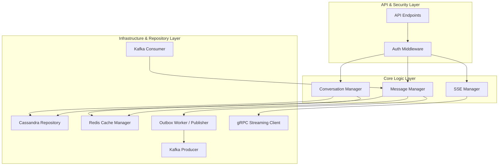
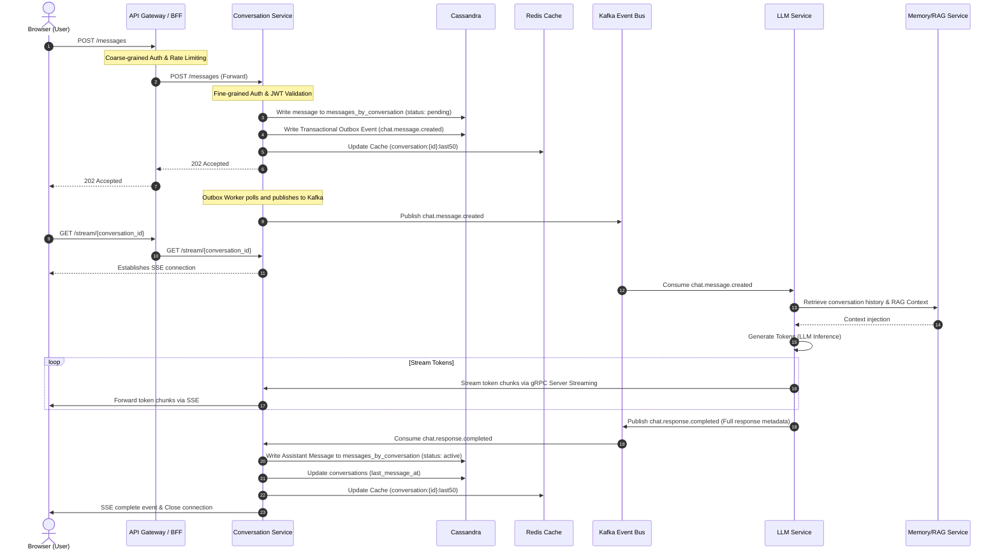
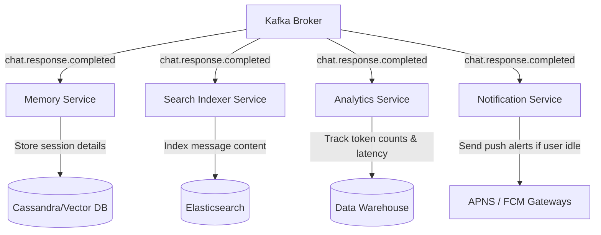
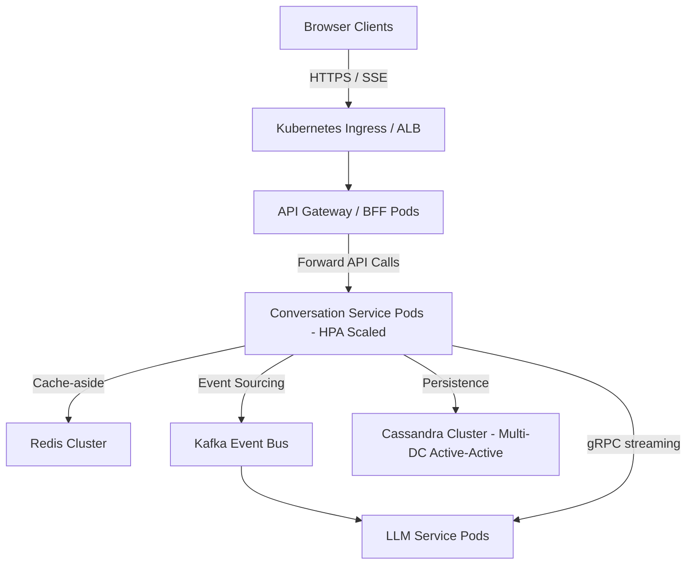
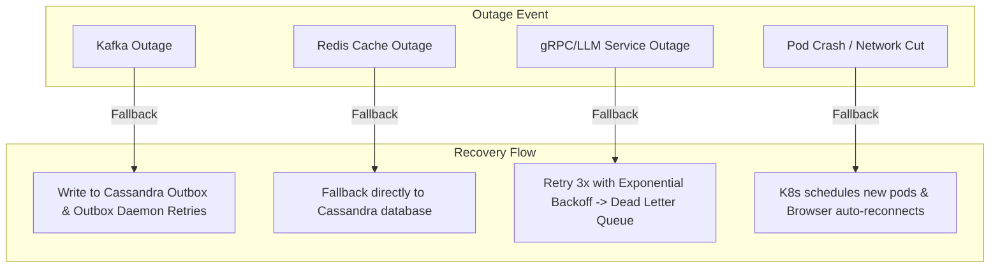

For a **production-scale GraphGPT**, I would simplify and standardize the architecture. I **would not** keep both "Kafka full response" and "gRPC streaming" as parallel production paths because it increases operational complexity, duplicates logic, and makes ownership unclear.

Instead, use **one consistent architecture**:

* **Kafka** → Business events
* **gRPC Server Streaming** → LLM → Conversation Service
* **SSE** → Conversation Service → Browser

This is the architecture most AI platforms converge toward because every component has a single responsibility.

---

# Conversation Service - High Level Design (Production Scale)

# 1. Overview

The Conversation Service is the central orchestration service responsible for managing conversations across the GraphGPT platform.

It acts as the single source of truth for conversation state while coordinating communication between frontend clients and downstream AI services.

The service is responsible for:

* Managing conversation lifecycle
* Persisting user and assistant messages
* Streaming AI responses
* Publishing business events
* Serving conversation history
* Managing conversation metadata
* Maintaining message ordering
* Coordinating downstream services

The service **does not perform AI inference**.

LLM inference is delegated to the LLM Service.

---

# 2. Goals

The architecture is designed for:

* Millions of users
* Millions of active conversations
* Horizontal scalability
* Stateless deployments
* Event-driven communication
* Real-time streaming
* Fault tolerance
* High availability
* Zero message loss
* Low latency

---

# 3. Responsibilities

### Conversation Management

* Create conversation
* Rename conversation
* Archive conversation
* Delete conversation
* List conversations
* Fetch metadata

---

### Message Management

* Persist user messages
* Persist assistant messages
* Maintain ordering
* Soft delete
* Retry generation
* Regenerate response

---

### Streaming

* Open SSE connection
* Forward streamed tokens
* Handle disconnects
* Complete streams
* Retry streams

---

### Event Management

Publish Kafka business events.

Consume downstream business events.

---

### History

* Latest messages
* Cursor pagination
* Infinite scroll
* Search

---

# 4. High-Level Architecture

```text
                    Browser
                        │
                REST + SSE
                        │
               API Gateway / BFF
                        │
              Conversation Service
        ┌──────────┼────────────┬────────────┐
        │          │            │            │
    Redis      Cassandra     Kafka      gRPC Client
                                  │            │
                                  ▼            │
                           LLM Service ◄───────┘
                                  │
                           Generates Tokens
```

---

# 5. Internal Components



## API Layer

In a zero-trust architecture, the API Gateway performs coarse-grained authentication (optional), while the Conversation Service's API Layer always validates the JWT token and enforces fine-grained authorization before processing any request.

Responsibilities:

* **JWT Verification**: Decodes and verifies signatures of bearer tokens on every request.
* **Authorization & Ownership Checks**: Verifies that the requesting user owns the conversation/message they are attempting to access.
* **Input Validation**: Sanitizes request bodies, parameters, and headers.
* **Rate Limiting**: Enforces tenant/user-level rate limit rules.

---

## Conversation Manager

Responsible for:

* Conversation CRUD
* Metadata
* Ownership

---

## Message Manager

Responsible for:

* User messages
* Assistant messages
* Ordering

---

## SSE Manager

Responsible for:

* Connection lifecycle
* Token forwarding
* Completion events
* Error events
* Reconnection

---

## gRPC Client

Maintains streaming connection with LLM Service.

Receives generated tokens.

---

## Kafka Producer

Publishes business events.

---

## Kafka Consumer

Consumes summary/title events.

---

## Cache Manager

Redis operations.

---

## Repository Layer

Cassandra operations.

---

## Background Workers

* Transactional Outbox Publisher
* Cache Cleanup
* Retry Processor

---

# 6. Communication Protocols

| Source       | Destination  | Protocol              | Purpose                  |
| ------------ | ------------ | --------------------- | ------------------------ |
| Browser      | Conversation | REST                  | Send messages            |
| Browser      | Conversation | SSE                   | Receive streamed tokens  |
| Conversation | Kafka        | Kafka Producer        | Publish business events  |
| Kafka        | LLM          | Kafka Consumer        | Start AI generation      |
| Conversation | LLM          | gRPC Server Streaming | Receive generated tokens |
| Conversation | Redis        | Redis                 | Cache                    |
| Conversation | Cassandra    | CQL                   | Persistence              |

---

# 7. Complete Request Flow

Here is the sequence diagram demonstrating the complete message creation, generation, and streaming loop:



### Step 1

Browser

↓

POST /messages

↓

Conversation Service

↓

Authenticate

↓

Validate

↓

Persist user message

↓

Update Redis

↓

Write Transactional Outbox

↓

Publish

```
chat.message.created
```

↓

Return

```
202 Accepted
```

---

### Step 2

Frontend opens

```
GET /stream/{conversation_id}
```

↓

SSE established.

---

### Step 3

LLM Service consumes

```
chat.message.created
```

↓

Build Prompt

↓

Retrieve Memory

↓

Retrieve RAG Context

↓

Generate Tokens

↓

Stream tokens using gRPC

↓

Conversation Service

---

### Step 4

Conversation Service

Immediately forwards each token through SSE.

```
data: Kafka

data: is

data: distributed

...
```

---

### Step 5

Generation completes.

Conversation Service

↓

Persist assistant message

↓

Update metadata

↓

Publish

```
chat.response.completed
```

↓

Close SSE

---

### 7.1 Downstream Event Flow

Once the conversation generation completes and `chat.response.completed` is published to Kafka, several independent microservices consume this event to trigger background jobs asynchronously:



---

# 8. Kafka Topics

## Published

| Topic                   | Purpose                |
| ----------------------- | ---------------------- |
| chat.message.created    | Trigger AI generation  |
| conversation.created    | New conversation       |
| conversation.updated    | Metadata changed       |
| conversation.deleted    | Cleanup                |
| message.deleted         | Soft delete            |
| chat.response.completed | AI generation finished |

---

## Consumed

| Topic                          | Publisher      |
| ------------------------------ | -------------- |
| conversation.summary.generated | Memory Service |
| conversation.title.generated   | LLM Service    |

---

## Event Schemas (JSON Payloads)

### 1. `chat.message.created`
Fired when a user sends a message. Consumed by the LLM service to begin token generation.
```json
{
  "event_id": "9b1deb4d-3b7d-4bad-9bdd-2b0d7b3dcb6d",
  "event_type": "chat.message.created",
  "timestamp": "2026-07-25T14:15:08Z",
  "payload": {
    "conversation_id": "8a3deb4d-1b2c-3d4e-5f6a-7b8c9d0e1f2a",
    "message_id": "0190ebd7-775c-7db5-9e6e-cb4d4d1da9a2",
    "user_id": "3c3aeb4b-2b3c-4d5e-6f7a-8b9c0d1e2f3a",
    "content": "What is Apache Cassandra and how does it scale?",
    "created_at": "2026-07-25T14:15:07Z"
  }
}
```

### 2. `chat.response.completed`
Fired when the assistant finishes generating a response. Consumed by search indexers, memory/RAG storage systems, and notification engines.
```json
{
  "event_id": "2d1deb4d-5c7d-4bad-9bdd-2b0d7b3dcb6d",
  "event_type": "chat.response.completed",
  "timestamp": "2026-07-25T14:15:15Z",
  "payload": {
    "conversation_id": "8a3deb4d-1b2c-3d4e-5f6a-7b8c9d0e1f2a",
    "message_id": "0190ebd7-7a5f-7db5-9e6e-fb4d4d1da9bc",
    "user_id": "3c3aeb4b-2b3c-4d5e-6f7a-8b9c0d1e2f3a",
    "role": "assistant",
    "full_content": "Apache Cassandra is a distributed, wide-column NoSQL database...",
    "token_count": 482,
    "generation_latency_ms": 7240,
    "completed_at": "2026-07-25T14:15:15Z"
  }
}
```

---

# 9. Database

## Apache Cassandra

To support millions of users and high write throughput, we use a distributed, wide-column database (Apache Cassandra) designed for horizontal scalability and high availability with no single point of failure.

### Data Modeling (Query-Driven Design)

Cassandra requires query-driven schema design. Since secondary indexes do not scale, we create dedicated tables optimized for specific query patterns.

#### 1. Listing Conversations per User
* **Table**: `conversations_by_user`
* **Pattern**: Fetch all conversations belonging to a user, ordered by recency.
* **Schema**:
  ```sql
  CREATE TABLE conversations_by_user (
      user_id uuid,
      updated_at timestamp,
      conversation_id uuid,
      title text,
      created_at timestamp,
      status text, -- active, archived, deleted
      PRIMARY KEY (user_id, updated_at, conversation_id)
  ) WITH CLUSTERING ORDER BY (updated_at DESC, conversation_id ASC);
  ```

#### 2. Fetching Conversation Metadata
* **Table**: `conversations`
* **Pattern**: Lookup metadata for a specific conversation.
* **Schema**:
  ```sql
  CREATE TABLE conversations (
      conversation_id uuid,
      user_id uuid,
      title text,
      created_at timestamp,
      updated_at timestamp,
      status text,
      PRIMARY KEY (conversation_id)
  );
  ```

#### 3. Reading and Writing Messages
* **Table**: `messages_by_conversation`
* **Pattern**: Retrieve message history for a conversation ordered chronologically (or reverse).
* **Schema**:
  ```sql
  CREATE TABLE messages_by_conversation (
      conversation_id uuid,
      message_id timeuuid, -- TimeUUID ensures uniqueness and temporal ordering
      sender text, -- user, assistant
      content text,
      created_at timestamp,
      status text, -- active, soft_deleted
      PRIMARY KEY (conversation_id, message_id)
  ) WITH CLUSTERING ORDER BY (message_id DESC);
  ```
  * *Note: Using `message_id DESC` allows fast pagination fetching the latest messages first (e.g., `WHERE conversation_id = ? AND message_id < ? LIMIT 50`).*

---

### Partition Sizing and Scaling
* **Target Size**: Under 100MB per partition (ideally < 20MB) and under 100,000 rows.
* **Analysis**: 
  * With `conversation_id` as the partition key for `messages_by_conversation`, a partition holds all messages for one conversation.
  * At ~1KB average message size, 100MB fits ~100,000 messages, which is far beyond the typical lifetime of an LLM conversation (usually < 1,000 messages).
  * If a system requirement allows infinite conversations, bucketing can be introduced: `PRIMARY KEY ((conversation_id, bucket_id), message_id)` where `bucket_id` is a year-month string (e.g. `2026-07`) or integer bucket.

---

### Compaction Strategies
* **conversations_by_user** & **conversations**: Use `LeveledCompactionStrategy` (LCS). These tables experience frequent updates (e.g. `updated_at` and `title` changes). LCS reduces read latency and minimizes disk space overhead by grouping data into levels.
* **messages_by_conversation**: Use `TimeWindowCompactionStrategy` (TWCS) or `SizeTieredCompactionStrategy` (STCS). Messages are write-once, read-many (immutable time-series-like data). TWCS groups SSTables based on time windows, which is optimal for chronological chat logs.

---

### Consistency Levels
* **Writes**: `LOCAL_QUORUM` (strongly consistent write within the local region, ensuring high availability while preventing split-brain issues across regions).
* **Reads**: `LOCAL_QUORUM` (for strict message sequencing and read-your-own-writes consistency) or `LOCAL_ONE` when combined with the Redis cache-aside pattern to minimize database read path latency.

---

# 10. Redis

Stores only transient state.

### Keys

```
conversation:{id}
```

Conversation metadata.

---

```
conversation:{id}:last50
```

Recent messages.

---

```
stream:{conversation_id}
```

Maps conversation to the pod handling the active SSE connection.

---

```
idempotency:{request_id}
```

Duplicate request prevention.

---

```
rate:{user}
```

Rate limiting.

---

# 11. Pagination

Cursor pagination.

```
GET /messages?limit=50
```

↓

Latest 50 messages.

Older messages

```
GET /messages?cursor=msg_8271
```

↓

Messages before cursor.

---

# 11.1 API Endpoints

All endpoints require a `Authorization: Bearer <JWT>` header. The Conversation Service performs validation and verifies resource ownership on every request.

### 1. Create Conversation
* **HTTP Method**: `POST`
* **Path**: `/conversations`
* **Request Payload**:
  ```json
  {
    "title": "New Conversation"
  }
  ```
* **Success Response (`201 Created`)**:
  ```json
  {
    "conversation_id": "8a3deb4d-1b2c-3d4e-5f6a-7b8c9d0e1f2a",
    "title": "New Conversation",
    "created_at": "2026-07-25T14:15:08Z"
  }
  ```

### 2. List Conversations (Paginated)
* **HTTP Method**: `GET`
* **Path**: `/conversations?limit=20&cursor=2026-07-25T14%3A15%3A08Z`
* **Success Response (`200 OK`)**:
  ```json
  {
    "items": [
      {
        "conversation_id": "8a3deb4d-1b2c-3d4e-5f6a-7b8c9d0e1f2a",
        "title": "Apache Cassandra Scaling",
        "updated_at": "2026-07-25T14:15:08Z"
      }
    ],
    "next_cursor": "2026-07-24T12:00:00Z"
  }
  ```

### 3. Delete Conversation (Soft Delete)
* **HTTP Method**: `DELETE`
* **Path**: `/conversations/{conversation_id}`
* **Success Response (`204 No Content`)**: Empty response body.

### 4. Create Message
* **HTTP Method**: `POST`
* **Path**: `/messages`
* **Request Headers**: `X-Idempotency-Key: <UUID>` (Optional, to prevent duplication)
* **Request Payload**:
  ```json
  {
    "conversation_id": "8a3deb4d-1b2c-3d4e-5f6a-7b8c9d0e1f2a",
    "content": "What is Apache Cassandra?"
  }
  ```
* **Success Response (`202 Accepted`)**:
  ```json
  {
    "message_id": "0190ebd7-775c-7db5-9e6e-cb4d4d1da9a2",
    "status": "pending"
  }
  ```

### 5. Fetch Message History (Paginated)
* **HTTP Method**: `GET`
* **Path**: `/messages?conversation_id={conversation_id}&limit=50&cursor={timeuuid}`
* **Success Response (`200 OK`)**:
  ```json
  {
    "items": [
      {
        "message_id": "0190ebd7-775c-7db5-9e6e-cb4d4d1da9a2",
        "sender": "user",
        "content": "What is Apache Cassandra?",
        "created_at": "2026-07-25T14:15:07Z"
      }
    ],
    "next_cursor": "0190ebd7-775c-7db5-9e6e-cb4d4d1da9a1"
  }
  ```

### 6. Stream Assistant Tokens
* **HTTP Method**: `GET`
* **Path**: `/stream/{conversation_id}`
* **Headers**: `Accept: text/event-stream`
* **Response Stream**:
  ```text
  event: token
  data: {"chunk": "Apache"}

  event: token
  data: {"chunk": " Cassandra"}

  event: completed
  data: {"message_id": "0190ebd7-7a5f-7db5-9e6e-fb4d4d1da9bc"}
  ```

---

# 12. Scaling Strategy

The Conversation Service is designed as a stateless microservice to enable horizontal scalability.

### Deployment Topology



### Capacity Planning (Millions of Users)

To size our infrastructure for **100M total users** and **5M Daily Active Users (DAU)**, we calculate resources as follows:

#### 1. Throughput Calculations
* **Assumptions**:
  * 5,000,000 Daily Active Users (DAU).
  * Average of 100 messages (user + assistant combined) per active user per day.
  * Total daily messages = 5,000,000 * 100 = 500,000,000 messages/day.
* **Writes per second**:
  * Daily database writes (messages & outbox events) = 500M messages * 2 writes (1 user message + 1 assistant message) = 1,000,000,000 writes/day.
  * Average Write TPS = 1,000,000,000 writes / 86,400 seconds ≈ **11,574 writes/sec**.
  * Peak Write TPS (5x multiplier for peak hours) = **57,870 writes/sec**.
* **Reads per second**:
  * Read requests are highly cached in Redis. With a 95% Redis cache hit ratio, database read path gets 5% of traffic.
  * If users fetch history 5 times per session (25M total reads/day): 25,000,000 / 86,400 ≈ 290 reads/sec average, peak ≈ 1,450 reads/sec.

#### 2. Storage Calculations (Cassandra)
* **Message Size**: ~1 KB average size (including UUIDs, timestamps, sender, metadata, and message content).
* **Data Growth**:
  * Daily raw data storage = 500,000,000 messages * 1 KB = 500 GB/day.
  * Yearly raw data storage = 500 GB * 365 = 182.5 TB/year.
  * With replication factor (RF) of 3 = 182.5 TB * 3 = **547.5 TB/year**.
* **Cassandra Node Count Sizing**:
  * Target disk space per Cassandra node = 2 TB (using NVMe SSDs to maintain fast reads/compactions).
  * Total nodes required for storage = 547.5 TB / 2 TB = **274 nodes** total (approx. 90 nodes per DC in a 3-DC setup).
  * Target write capacity: A standard node handles ~5,000 writes/sec. For 57,870 peak writes/sec, we require at least 12 write-active nodes in the local DC. Thus, our storage sizing (90 nodes per DC) easily satisfies the compute/write performance requirements.

#### 3. Event Bus (Kafka)
* **Kafka Partitions Sizing**:
  * Peak rate: 57,870 events/sec.
  * Max target throughput per partition: 1 MB/s (approx. 1,000 events/sec of 1KB size).
  * Partition count for message/generation topics: 57,870 / 1,000 ≈ **64 partitions**.

#### 4. Cache (Redis Cluster)
* **Cache Strategy**: Cache the metadata of active conversations and the last 50 messages.
* **Cached Item Sizing**:
  * Last 50 messages + metadata ≈ 55 KB per conversation.
  * Peak concurrent active conversations: 500,000 concurrent users/conversations.
  * Required memory: 500,000 * 55 KB ≈ 27.5 GB.
  * With cluster overhead & primary-replica model: **60 GB Redis Cluster** (e.g., 6 shards of 10 GB each, plus replicas).

#### 5. Pod Count (HPA)
* **Conversation Service**:
  * Each FastAPI pod (highly async) processes ~1,000 requests/sec with minimal CPU overhead.
  * Average load requires 12 pods. Peak load (58k writes/sec + API calls) requires ~60 pods.
  * Autoscaler: Scale dynamically between **15 and 80 pods** using custom metrics (CPU > 60% or concurrent SSE connections > 5,000).

---

### Cassandra Scalability

To scale to millions of active users globally:
1. **Multi-Region Replication**: Cassandra's native multi-DC replication enables active-active writes and reads local to the user's region, utilizing `NetworkTopologyStrategy` with a Replication Factor of 3.
2. **Linear Scalability**: We can scale writes and storage capacity linearly by adding more Cassandra nodes to the ring without downtime.
3. **Partition Key Selection**: `conversation_id` (UUIDv4) and `user_id` (UUIDv4) act as high-cardinality partition keys. This ensures uniform distribution of data across all nodes in the cluster, preventing hot spots and uneven storage distribution.
4. **Client Connection Pooling**: Use token-aware connection routing in the driver to bypass coordinator nodes and query the replica directly, reducing latency and cluster internal traffic.

---

Kafka partition key

```
conversation_id
```

Guarantees ordering.

---

# 13. Failure Handling and Recovery Paths

This section details how the platform maintains high availability and handles service outages transparently.



### 1. Kafka Broker Down (Event Bus Failure)
- **Impact**: Generation triggers cannot be queued immediately.
- **Recovery Path**: 
  1. The API Layer continues to write the message to the `messages_by_conversation` table in Cassandra.
  2. The event metadata is written to the `transactional_outbox` table in Cassandra in the same transaction block.
  3. The background Outbox Daemon runs in a retry loop (with exponential backoff and jitter), publishing events to Kafka when it recovers.
  4. This decouples message submission from the LLM pipeline, guaranteeing zero message loss.

### 2. Redis Down (Cache Layer Outage)
- **Impact**: Cache-aside queries fail, increasing database read load.
- **Recovery Path**:
  1. A Circuit Breaker monitors Redis connectivity. Upon detecting failure, the cache is bypassed.
  2. All operations fallback directly to the Cassandra cluster (`conversations` and `messages_by_conversation` tables).
  3. A background task attempts to re-establish Redis connection and initiates cache repopulation once Redis is healthy.

### 3. LLM Service or gRPC Down (Inference Failure)
- **Impact**: Token generation fails mid-stream or fails to start.
- **Recovery Path**:
  1. The gRPC client in the Conversation Service implements a retry policy with exponential backoff (e.g., 3 retries over 10 seconds).
  2. If the LLM is completely down, the stream is aborted. An error token/event is dispatched via SSE to the browser to notify the user.
  3. The message is pushed to a Kafka Dead Letter Queue (DLQ) (`chat.message.dlq`) for manual recovery or offline analysis.

### 4. Pod Crashes (Service Pod Failure)
- **Impact**: Active client SSE connections terminate abruptly.
- **Recovery Path**:
  1. Kubernetes Liveness/Readiness probes detect the failed pod and evict it from the Service routing pool.
  2. Kubernetes HPA automatically schedules new pods to maintain target replicas.
  3. The client browser detects the SSE connection drop and initiates an exponential backoff reconnect attempt (`GET /stream/{conversation_id}`).
  4. The newly assigned pod reads the active generation state from Redis (`stream:{conversation_id}`) or continues updating from history.

### 5. Duplicate Events (Kafka Network Partitions)
- **Impact**: Duplicate execution of LLM generation.
- **Recovery Path**:
  1. Implements the **Inbox Pattern**. The system saves processed event IDs into an `inbox_events` Cassandra table.
  2. Before executing any message generation, the consumer checks this table. If the event ID exists, it skips processing.

---

# 14. Security

* JWT
* RBAC
* Conversation ownership
* TLS
* Input validation
* Audit logging
* Rate limiting

---

# 15. Monitoring

Metrics

* API latency
* SSE connections
* Active conversations
* Kafka lag
* Redis hit ratio
* DB latency
* Error rate
* gRPC latency
* Token generation latency

Logs

* Centralized logging

Tracing

* OpenTelemetry

---

# 16. Production Design Patterns

* Transactional Outbox
* Inbox Pattern
* Idempotency Keys
* Retry with Exponential Backoff
* Dead Letter Queue
* Circuit Breaker
* Bulkhead Isolation
* Cursor Pagination
* Cache Aside Pattern
* Optimistic Locking

---

# 17. Technology Stack

| Component        | Technology             | Reason                                       |
| ---------------- | ---------------------- | -------------------------------------------- |
| API              | FastAPI                | Async performance                            |
| Database         | Apache Cassandra       | Wide-column, linear scalability, multi-DC active-active |
| Cache            | Redis Cluster          | Low latency                                  |
| Event Bus        | Kafka                  | Durable business events                      |
| AI Transport     | gRPC Server Streaming  | Efficient service-to-service token streaming |
| Client Streaming | SSE                    | Native browser support                       |
| Deployment       | Kubernetes             | Horizontal scaling                           |
| Monitoring       | Prometheus + Grafana   | Metrics                                      |
| Logging          | ELK / OpenSearch       | Centralized logs                             |
| Tracing          | OpenTelemetry + Jaeger | Distributed tracing                          |

---

## 17.1 Kubernetes Design & Resource Management

To manage a deployment at a scale of millions of active users, the Kubernetes infrastructure enforces the following resource patterns and configurations:

### 1. Workload Deployment Specifications
* **Rolling Update Strategy**: Deployment configurations enforce `RollingUpdate` with `maxSurge: 25%` and `maxUnavailable: 0%` to guarantee zero-downtime deployments.
* **Resource Allocations**:
  * **FastAPI Pod Requests**: `CPU: 1000m`, `Memory: 1Gi`
  * **FastAPI Pod Limits**: `CPU: 2000m`, `Memory: 2Gi`

### 2. High Availability & Traffic Control
* **Horizontal Pod Autoscaling (HPA)**: Scaled dynamically based on:
  * CPU Utilization > 60%
  * Memory Utilization > 70%
  * SSE connection count per pod (> 5,000 concurrent streams)
* **Pod Disruption Budget (PDB)**: Enforces `minAvailable: 50%` to prevent concurrent restarts during nodes draining or cluster upgrades.
* **Probes**:
  * **Liveness Probe**: HTTP GET `/healthz` (checks pod process healthiness).
  * **Readiness Probe**: HTTP GET `/ready` (checks external dependency connectivity - Redis, Cassandra, Kafka).

### 3. Configuration & Secrets Management
* **ConfigMaps**: Store environment variables (e.g., Kafka brokers lists, Cassandra datacenter names, cluster configurations).
* **Kubernetes Secrets**: Encrypt sensitive variables (e.g., DB credentials, Redis password, Kafka SASL tokens).
* **TLS Termination**: Handled at the ALB Ingress controller, with internal communication encrypted using mTLS via an Istio service mesh (Zero-Trust security model).

---

## Architecture Principles

1. **Conversation Service owns conversation state**: Only this service creates, updates, and persists conversations and messages.
2. **LLM Service owns inference**: It consumes generation requests, retrieves context (memory/RAG), generates tokens, and streams them back.
3. **Kafka carries durable business events**: Events such as `chat.message.created` and `chat.response.completed` are replayable and consumed by other services.
4. **gRPC carries real-time service-to-service streams**: Tokens are streamed efficiently from the LLM Service to the Conversation Service without flooding Kafka.
5. **SSE carries real-time browser updates**: The Conversation Service forwards tokens to the client over SSE using standard HTTP.

This separation keeps the system scalable, minimizes unnecessary Kafka traffic, and provides a clean ownership model that's suitable for enterprise-scale AI applications.
