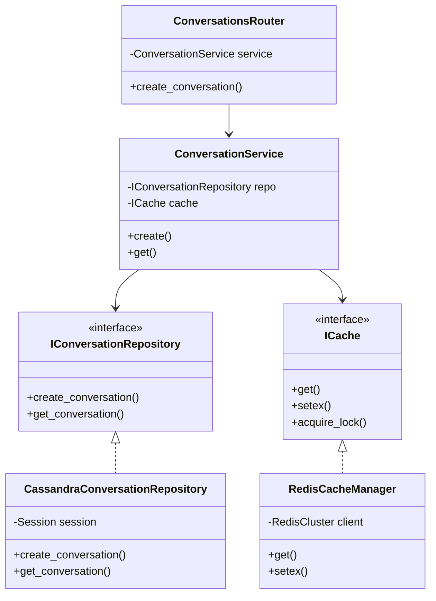
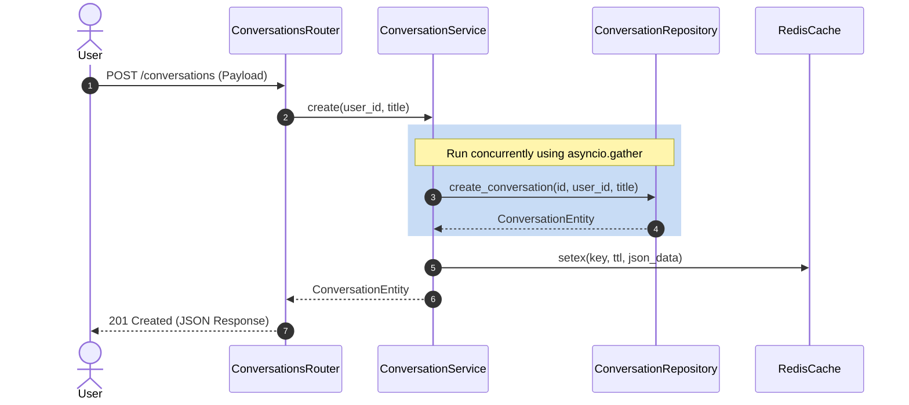
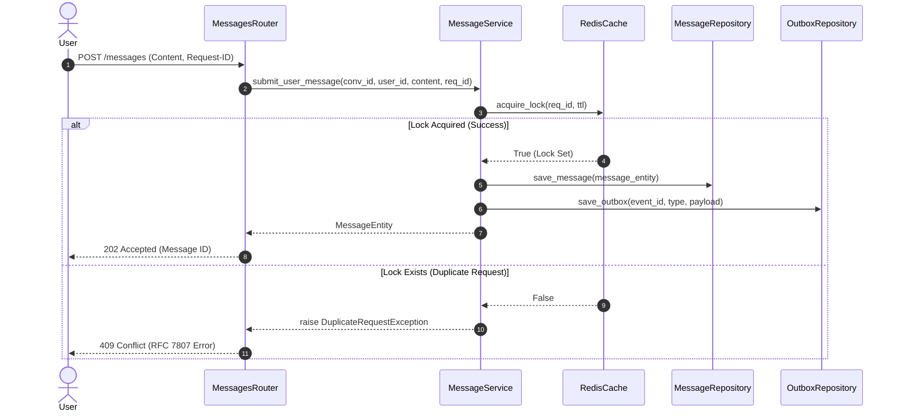
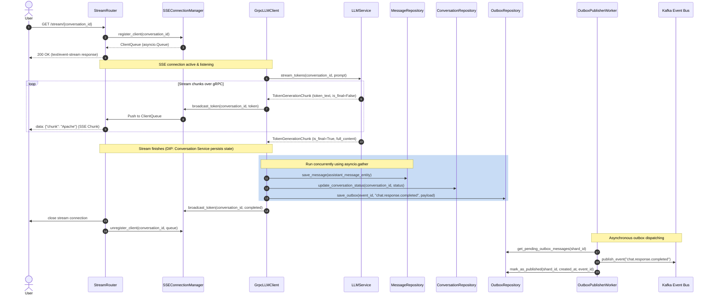
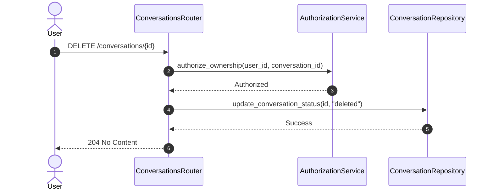

# Conversation Service - Low Level Design (LLD)

---

# 1. Executive Summary & Technology Stack Matrix

The **Conversation Service** is the central orchestrator for the GraphGPT platform, managing conversation lifecycles, user/assistant message history, token streaming, and transactional event generation.

This document describes the internal structure, class structures, interface definitions, database models, caching strategies, and failover/retry mechanisms designed to scale to millions of active users.

## 1.1 Technology Stack Matrix

| Layer / Component | Technology | Version Range | Purpose & Selection Rationale |
| :--- | :--- | :--- | :--- |
| **Runtime & Language** | Python | `3.12+` | Async execution engine (`asyncio`), strong typing, and native Pydantic v2 support. |
| **Web Framework** | FastAPI | `0.110+` | High-throughput asynchronous framework running on Starlette / Uvicorn. |
| **Database** | Apache Cassandra | `4.x` | Wide-column NoSQL database for linear write scaling and active-active multi-DC replication. |
| **Cache Store** | Redis Cluster | `7.x` | Distributed in-memory data store for transient states, rate limiting, and caches. |
| **Event Bus** | Apache Kafka | `3.x` | Event streaming platform for business-critical events. |
| **RPC Protocol** | gRPC / HTTP/2 | `1.6x` | Low-latency binary streaming protocol between LLM and Conversation Service. |
| **Data Validation** | Pydantic | `2.x` | Validates data schemas, parses environment configuration. |
| **Structured Logging**| `structlog` | `24.x` | Structured JSON logging with trace ID propagation. |

---

# 2. Package & Modular Architecture Structure

The directory layout enforces **Clean Architecture**, segregating domain interfaces, services, API presentation, and infrastructure adapters:

```text
conversation-service/
├── app/
│   ├── main.py                          # ASGI application initialization
│   ├── api/                             # Presentation Layer (HTTP & SSE)
│   │   ├── v1/
│   │   │   ├── conversations.py         # Conversation CRUD handlers
│   │   │   ├── messages.py              # Message submit & fetch history handlers
│   │   │   └── stream.py                # Server-Sent Events (SSE) router
│   │   └── middleware/
│   │       ├── auth.py                  # JWT Auth Middleware
│   │       └── rate_limiter.py          # Sliding window rate limiter
│   ├── core/                            # Config, security, & observability
│   │   ├── config.py
│   │   ├── dependencies.py              # FastAPI Dependency Injection definitions
│   │   └── metrics.py
│   ├── domain/                          # Domain Core (Interfaces & Entities)
│   │   ├── interfaces.py                # Abstract Base Classes (ABC)
│   │   ├── entities.py                  # Domain Dataclasses
│   │   ├── enums.py                     # Enums
│   │   └── exceptions.py                # Domain Exception taxonomy
│   ├── infrastructure/                  # Infrastructure Adapters
│   │   ├── db/
│   │   │   ├── session.py               # Cassandra cluster connection manager
│   │   │   └── repositories.py          # Concrete repository implementations
│   │   ├── cache/
│   │   │   ├── redis_client.py          # Redis Cluster implementation
│   │   │   └── circuit_breaker.py       # Circuit breaker logic
│   │   ├── kafka/
│   │   │   └── producer.py              # Kafka event publisher
│   │   └── grpc/
│   │       └── client.py                # gRPC LLM connection client
│   ├── services/                        # Application Services (Use cases)
│   │   ├── conversation_service.py      # Conversation orchestration
│   │   ├── message_service.py           # Message validation & outbox registration
│   │   ├── streaming_service.py         # SSE token broadcasting
│   │   └── authorization_service.py     # User permission authorization
│   └── workers/                         # Background daemons
│       ├── outbox_publisher.py          # Transactional Outbox worker
│       └── inbox_processor.py           # Kafka event deduplicator
└── cql/
    └── schema.cql                       # CQL Table DDL script
```

---

# 3. Domain Entities, Models & Enums

## 3.1 System Enums (`app/domain/enums.py`)

```python
from enum import Enum

class SenderType(str, Enum):
    USER = "user"
    ASSISTANT = "assistant"
    SYSTEM = "system"

class MessageStatus(str, Enum):
    PENDING = "pending"
    ACTIVE = "active"
    SOFT_DELETED = "soft_deleted"
    FAILED = "failed"

class ConversationStatus(str, Enum):
    ACTIVE = "active"
    ARCHIVED = "archived"
    DELETED = "deleted"

class OutboxStatus(str, Enum):
    PENDING = "PENDING"
    PUBLISHED = "PUBLISHED"
    FAILED = "FAILED"

class EventType(str, Enum):
    CHAT_MESSAGE_CREATED = "chat.message.created"
    CHAT_RESPONSE_COMPLETED = "chat.response.completed"
    CONVERSATION_CREATED = "conversation.created"
    CONVERSATION_UPDATED = "conversation.updated"
    CONVERSATION_DELETED = "conversation.deleted"
    MESSAGE_DELETED = "message.deleted"
```

## 3.2 Domain Entities (`app/domain/entities.py`)

```python
from dataclasses import dataclass
from datetime import datetime
from uuid import UUID
from typing import List, Optional
from app.domain.enums import ConversationStatus, MessageStatus, SenderType

@dataclass
class UserContext:
    user_id: UUID
    roles: List[str]
    tenant_id: Optional[str] = None

@dataclass
class ConversationEntity:
    conversation_id: UUID
    user_id: UUID
    title: str
    created_at: datetime
    updated_at: datetime
    status: ConversationStatus

@dataclass
class MessageEntity:
    message_id: UUID
    conversation_id: UUID
    sender: SenderType
    content: str
    created_at: datetime
    status: MessageStatus
```

---

# 3.3 Abstract Base Interfaces (`app/domain/interfaces.py`)

To enforce **Dependency Inversion (DIP)** and ensure testability with mocks, all database, cache, and client adapters inherit from abstract base interfaces.

```python
from abc import ABC, abstractmethod
from uuid import UUID
from datetime import datetime
from typing import List, Optional, AsyncGenerator
from app.domain.entities import ConversationEntity, MessageEntity

class IConversationRepository(ABC):
    @abstractmethod
    async def create_conversation(self, conversation_id: UUID, user_id: UUID, title: str, created_at: datetime) -> ConversationEntity:
        pass

    @abstractmethod
    async def get_conversation(self, conversation_id: UUID) -> Optional[ConversationEntity]:
        pass

    @abstractmethod
    async def list_conversations_by_user(self, user_id: UUID, limit: int, cursor: Optional[datetime]) -> List[ConversationEntity]:
        pass

    @abstractmethod
    async def update_conversation_status(self, conversation_id: UUID, status: str) -> None:
        pass

class IMessageRepository(ABC):
    @abstractmethod
    async def save_message(self, message: MessageEntity) -> None:
        pass

    @abstractmethod
    async def get_messages_by_conversation(self, conversation_id: UUID, limit: int, cursor_timeuuid: Optional[UUID]) -> List[MessageEntity]:
        pass

class IOutboxRepository(ABC):
    @abstractmethod
    async def save_outbox(self, event_id: UUID, event_type: str, payload_json: str, created_at: datetime) -> None:
        pass

    @abstractmethod
    async def get_pending_outbox_messages(self, shard_id: int, limit: int) -> List[dict]:
        pass

    @abstractmethod
    async def mark_as_published(self, shard_id: int, created_at: datetime, event_id: UUID) -> None:
        pass

class IInboxRepository(ABC):
    @abstractmethod
    async def is_event_processed(self, event_id: UUID) -> bool:
        pass

    @abstractmethod
    async def mark_event_processed(self, event_id: UUID, event_type: str) -> None:
        pass

class ICache(ABC):
    @abstractmethod
    async def get(self, key: str) -> Optional[str]:
        pass

    @abstractmethod
    async def setex(self, key: str, ttl_seconds: int, value: str) -> bool:
        pass

    @abstractmethod
    async def delete(self, key: str) -> bool:
        pass

    @abstractmethod
    async def acquire_lock(self, lock_key: str, ttl_seconds: int) -> bool:
        pass

    @abstractmethod
    async def get_list(self, key: str) -> List[str]:
        pass

    @abstractmethod
    async def push_list(self, key: str, values: List[str], max_size: int, ttl_seconds: int) -> bool:
        pass

    @abstractmethod
    async def is_rate_limited(self, rate_key: str, limit: int, window_seconds: int) -> bool:
        pass

class IKafkaProducer(ABC):
    @abstractmethod
    async def publish_event(self, topic: str, key: str, payload_json: str) -> None:
        pass

class ILLMClient(ABC):
    @abstractmethod
    def stream_tokens(self, conversation_id: str, message_id: str, user_id: str, prompt: str) -> AsyncGenerator[dict, None]:
        pass
```

---

# 4. Data Access Layer & Cassandra CQL Specifications

## 4.1 Cassandra Schema DDL (`cql/schema.cql`)

```sql
CREATE KEYSPACE IF NOT EXISTS graphgpt_conversations
WITH replication = {
    'class': 'NetworkTopologyStrategy',
    'us-east-1': 3,
    'us-west-2': 3
} AND durable_writes = true;

USE graphgpt_conversations;

-- User conversation catalog (Partitioned by user_id)
CREATE TABLE IF NOT EXISTS conversations_by_user (
    user_id uuid,
    updated_at timestamp,
    conversation_id uuid,
    title text,
    created_at timestamp,
    status text,
    PRIMARY KEY (user_id, updated_at, conversation_id)
) WITH CLUSTERING ORDER BY (updated_at DESC, conversation_id ASC)
  AND compaction = {'class': 'LeveledCompactionStrategy'};

-- Conversation metadata (Partitioned by conversation_id)
CREATE TABLE IF NOT EXISTS conversations (
    conversation_id uuid,
    user_id uuid,
    title text,
    created_at timestamp,
    updated_at timestamp,
    status text,
    PRIMARY KEY (conversation_id)
) WITH compaction = {'class': 'LeveledCompactionStrategy'};

-- Message logs (Clustered chronologically via TimeUUID)
CREATE TABLE IF NOT EXISTS messages_by_conversation (
    conversation_id uuid,
    message_id timeuuid,
    sender text,
    content text,
    created_at timestamp,
    status text,
    PRIMARY KEY (conversation_id, message_id)
) WITH CLUSTERING ORDER BY (message_id DESC)
  AND compaction = {
    'class': 'TimeWindowCompactionStrategy',
    'compaction_window_unit': 'DAYS',
    'compaction_window_size': 1
  };

-- Transactional outbox table
CREATE TABLE IF NOT EXISTS transactional_outbox (
    shard_id int,
    created_at timestamp,
    event_id uuid,
    event_type text,
    payload text,
    status text,
    PRIMARY KEY (shard_id, created_at, event_id)
) WITH CLUSTERING ORDER BY (created_at ASC, event_id ASC)
  AND compaction = {'class': 'SizeTieredCompactionStrategy'};

-- Event Inbox deduplicator (7 days TTL auto eviction)
CREATE TABLE IF NOT EXISTS inbox_events (
    event_id uuid,
    processed_at timestamp,
    event_type text,
    PRIMARY KEY (event_id)
) WITH default_time_to_live = 604800
  AND compaction = {'class': 'SizeTieredCompactionStrategy'};
```

## 4.2 Cassandra Repository Splits & Async Thread Execution

### 4.2.1 Logged Batch Anti-Pattern & Redesign
In Cassandra, using `BEGIN BATCH` across tables with different partition keys (`conversations` partitioned by `conversation_id` and `conversations_by_user` partitioned by `user_id`) invokes a **logged batch**. Logged batches generate coordinator overhead, double write amplification, and increase latency.
To scale to millions of users, we remove logged batches for cross-partition writes and execute them as **parallel async tasks** via `asyncio.gather`. 

### 4.2.2 Async Cassandra Implementation
Since the DataStax Cassandra driver executes network I/O synchronously under `session.execute`, we run database interactions in a background thread pool executor using `asyncio.to_thread` to prevent blocking FastAPI's async event loop.

```python
import asyncio
from uuid import UUID
from datetime import datetime
from typing import List, Optional
from app.domain.interfaces import IConversationRepository, IMessageRepository, IOutboxRepository
from app.domain.entities import ConversationEntity, MessageEntity
from app.domain.enums import ConversationStatus, MessageStatus, SenderType
from app.infrastructure.db.session import CassandraSessionManager

class CassandraConversationRepository(IConversationRepository):
    def __init__(self, session_manager: CassandraSessionManager):
        self.session = session_manager.session

    async def create_conversation(
        self, conversation_id: UUID, user_id: UUID, title: str, created_at: datetime
    ) -> ConversationEntity:
        stmt_conv = self.session.prepare("""
            INSERT INTO conversations (conversation_id, user_id, title, created_at, updated_at, status)
            VALUES (?, ?, ?, ?, ?, ?);
        """)
        stmt_user_conv = self.session.prepare("""
            INSERT INTO conversations_by_user (user_id, updated_at, conversation_id, title, created_at, status)
            VALUES (?, ?, ?, ?, ?, ?);
        """)

        # Execute concurrent writes without using cross-partition logged batches
        await asyncio.gather(
            asyncio.to_thread(
                self.session.execute, stmt_conv,
                (conversation_id, user_id, title, created_at, created_at, ConversationStatus.ACTIVE.value)
            ),
            asyncio.to_thread(
                self.session.execute, stmt_user_conv,
                (user_id, created_at, conversation_id, title, created_at, ConversationStatus.ACTIVE.value)
            )
        )

        return ConversationEntity(
            conversation_id=conversation_id,
            user_id=user_id,
            title=title,
            created_at=created_at,
            updated_at=created_at,
            status=ConversationStatus.ACTIVE
        )

    async def get_conversation(self, conversation_id: UUID) -> Optional[ConversationEntity]:
        stmt = self.session.prepare("""
            SELECT conversation_id, user_id, title, created_at, updated_at, status
            FROM conversations WHERE conversation_id = ?;
        """)
        
        result_set = await asyncio.to_thread(self.session.execute, stmt, (conversation_id,))
        row = result_set.one()
        if not row:
            return None
        return ConversationEntity(
            conversation_id=row[0],
            user_id=row[1],
            title=row[2],
            created_at=row[3],
            updated_at=row[4],
            status=ConversationStatus(row[5])
        )

    async def list_conversations_by_user(
        self, user_id: UUID, limit: int = 20, cursor: Optional[datetime] = None
    ) -> List[ConversationEntity]:
        if cursor:
            stmt = self.session.prepare("""
                SELECT user_id, updated_at, conversation_id, title, created_at, status
                FROM conversations_by_user
                WHERE user_id = ? AND updated_at < ?
                LIMIT ?;
            """)
            result_set = await asyncio.to_thread(self.session.execute, stmt, (user_id, cursor, limit))
        else:
            stmt = self.session.prepare("""
                SELECT user_id, updated_at, conversation_id, title, created_at, status
                FROM conversations_by_user
                WHERE user_id = ?
                LIMIT ?;
            """)
            result_set = await asyncio.to_thread(self.session.execute, stmt, (user_id, limit))

        return [
            ConversationEntity(
                user_id=row[0],
                updated_at=row[1],
                conversation_id=row[2],
                title=row[3],
                created_at=row[4],
                status=ConversationStatus(row[5])
            ) for row in result_set
        ]

    async def update_conversation_status(self, conversation_id: UUID, status: str) -> None:
        stmt = self.session.prepare("""
            UPDATE conversations SET status = ? WHERE conversation_id = ?;
        """)
        await asyncio.to_thread(self.session.execute, stmt, (status, conversation_id))


class CassandraMessageRepository(IMessageRepository):
    def __init__(self, session_manager: CassandraSessionManager):
        self.session = session_manager.session

    async def save_message(self, message: MessageEntity) -> None:
        stmt = self.session.prepare("""
            INSERT INTO messages_by_conversation (conversation_id, message_id, sender, content, created_at, status)
            VALUES (?, ?, ?, ?, ?, ?);
        """)
        await asyncio.to_thread(
            self.session.execute, stmt,
            (message.conversation_id, message.message_id, message.sender.value,
             message.content, message.created_at, message.status.value)
        )

    async def get_messages_by_conversation(
        self, conversation_id: UUID, limit: int = 50, cursor_timeuuid: Optional[UUID] = None
    ) -> List[MessageEntity]:
        if cursor_timeuuid:
            stmt = self.session.prepare("""
                SELECT conversation_id, message_id, sender, content, created_at, status
                FROM messages_by_conversation
                WHERE conversation_id = ? AND message_id < ?
                LIMIT ?;
            """)
            result_set = await asyncio.to_thread(self.session.execute, stmt, (conversation_id, cursor_timeuuid, limit))
        else:
            stmt = self.session.prepare("""
                SELECT conversation_id, message_id, sender, content, created_at, status
                FROM messages_by_conversation
                WHERE conversation_id = ?
                LIMIT ?;
            """)
            result_set = await asyncio.to_thread(self.session.execute, stmt, (conversation_id, limit))

        return [
            MessageEntity(
                conversation_id=row[0],
                message_id=row[1],
                sender=SenderType(row[2]),
                content=row[3],
                created_at=row[4],
                status=MessageStatus(row[5])
            ) for row in result_set
        ]


class CassandraOutboxRepository(IOutboxRepository):
    def __init__(self, session_manager: CassandraSessionManager):
        self.session = session_manager.session

    async def save_outbox(self, event_id: UUID, event_type: str, payload_json: str, created_at: datetime) -> None:
        stmt = self.session.prepare("""
            INSERT INTO transactional_outbox (shard_id, created_at, event_id, event_type, payload, status)
            VALUES (?, ?, ?, ?, ?, ?);
        """)
        shard_id = hash(event_id) % 10
        await asyncio.to_thread(
            self.session.execute, stmt,
            (shard_id, created_at, event_id, event_type, payload_json, "PENDING")
        )

    async def get_pending_outbox_messages(self, shard_id: int, limit: int = 100) -> List[dict]:
        stmt = self.session.prepare("""
            SELECT shard_id, created_at, event_id, event_type, payload
            FROM transactional_outbox
            WHERE shard_id = ? AND status = 'PENDING'
            LIMIT ?;
        """)
        result_set = await asyncio.to_thread(self.session.execute, stmt, (shard_id, limit))
        return [
            {
                "shard_id": row[0],
                "created_at": row[1],
                "event_id": row[2],
                "event_type": row[3],
                "payload": row[4]
            } for row in result_set
        ]

    async def mark_as_published(self, shard_id: int, created_at: datetime, event_id: UUID) -> None:
        stmt = self.session.prepare("""
            UPDATE transactional_outbox SET status = 'PUBLISHED'
            WHERE shard_id = ? AND created_at = ? AND event_id = ?;
        """)
        await asyncio.to_thread(self.session.execute, stmt, (shard_id, created_at, event_id))
```

---

# 5. Caching Strategy & Redis Cluster Manager

## 5.1 Redis Cluster Client & Circuit Breaker (`app/infrastructure/cache/redis_client.py`)

```python
import asyncio
import logging
from typing import Optional
from redis.asyncio.cluster import RedisCluster
from app.domain.interfaces import ICache
from app.infrastructure.cache.circuit_breaker import RedisCircuitBreaker
from app.core.config import settings

logger = logging.getLogger(__name__)

class RedisCacheManager(ICache):
    def __init__(self, circuit_breaker: RedisCircuitBreaker):
        self.client: Optional[RedisCluster] = None
        self.breaker = circuit_breaker

    async def initialize(self):
        try:
            nodes = settings.REDIS_NODES.split(",")
            startup_nodes = [{"host": n.split(":")[0], "port": int(n.split(":")[1])} for n in nodes]
            self.client = RedisCluster(
                startup_nodes=startup_nodes,
                decode_responses=True,
                socket_timeout=settings.REDIS_TIMEOUT_SECONDS
            )
            await self.client.ping()
            self.breaker.record_success()
            logger.info("Connected to Redis Cluster.")
        except Exception as e:
            logger.error(f"Redis Cluster initialization failed: {e}")
            self.breaker.record_failure()

    async def get(self, key: str) -> Optional[str]:
        if not self.breaker.can_execute() or not self.client:
            return None
        try:
            val = await self.client.get(key)
            self.breaker.record_success()
            return val
        except Exception as e:
            self.breaker.record_failure()
            return None

    async def setex(self, key: str, ttl_seconds: int, value: str) -> bool:
        if not self.breaker.can_execute() or not self.client:
            return False
        try:
            await self.client.setex(key, ttl_seconds, value)
            self.breaker.record_success()
            return True
        except Exception as e:
            self.breaker.record_failure()
            return False

    async def delete(self, key: str) -> bool:
        if not self.breaker.can_execute() or not self.client:
            return False
        try:
            await self.client.delete(key)
            return True
        except Exception as e:
            self.breaker.record_failure()
            return False

    async def acquire_lock(self, lock_key: str, ttl_seconds: int = 10) -> bool:
        if not self.breaker.can_execute() or not self.client:
            return True # Cache degradation fallback: permit operation on fail
        try:
            acquired = await self.client.set(f"lock:{lock_key}", "LOCKED", nx=True, ex=ttl_seconds)
            return bool(acquired)
        except Exception as e:
            self.breaker.record_failure()
            return True

    async def get_list(self, key: str) -> List[str]:
        if not self.breaker.can_execute() or not self.client:
            return []
        try:
            val = await self.client.lrange(key, 0, -1)
            self.breaker.record_success()
            return val or []
        except Exception as e:
            self.breaker.record_failure()
            return []

    async def push_list(self, key: str, values: List[str], max_size: int, ttl_seconds: int) -> bool:
        if not self.breaker.can_execute() or not self.client:
            return False
        try:
            async with self.client.pipeline(transaction=True) as pipe:
                pipe.lpush(key, *values)
                pipe.ltrim(key, 0, max_size - 1)
                pipe.expire(key, ttl_seconds)
                await pipe.execute()
            self.breaker.record_success()
            return True
        except Exception as e:
            self.breaker.record_failure()
            return False

    async def is_rate_limited(self, rate_key: str, limit: int, window_seconds: int) -> bool:
        if not self.breaker.can_execute() or not self.client:
            return False # Fallback: allow requests on cache failure
        try:
            lua_rate_limit = """
            local key = KEYS[1]
            local limit = tonumber(ARGV[1])
            local window = tonumber(ARGV[2])
            local current = tonumber(redis.call('get', key) or "0")
            if current >= limit then
                return 1
            else
                redis.call('incr', key)
                if current == 0 then
                    redis.call('expire', key, window)
                end
                return 0
            end
            """
            result = await self.client.eval(lua_rate_limit, 1, rate_key, limit, window_seconds)
            self.breaker.record_success()
            return result == 1
        except Exception as e:
            self.breaker.record_failure()
            return False
```

---

# 6. Service Layer & Dependency Injection (DI)

## 6.1 FastAPI Dependency Trees (`app/core/dependencies.py`)

All dependencies are defined as injectable providers, ensuring mockability during unit testing.

```python
from fastapi import Depends
from app.core.config import settings
from app.infrastructure.db.session import CassandraSessionManager
from app.infrastructure.cache.redis_client import RedisCacheManager, RedisCircuitBreaker
from app.infrastructure.kafka.producer import KafkaEventPublisher
from app.infrastructure.db.repositories import (
    CassandraConversationRepository,
    CassandraMessageRepository,
    CassandraOutboxRepository
)
from app.domain.interfaces import IConversationRepository, IMessageRepository, IOutboxRepository, ICache, IKafkaProducer
from app.services.conversation_service import ConversationService
from app.services.message_service import MessageService
from app.services.authorization_service import AuthorizationService

# Base Session Providers
_session_manager = CassandraSessionManager()
_session_manager.connect()

_breaker = RedisCircuitBreaker()
_cache_manager = RedisCacheManager(_breaker)

def get_cassandra_repository() -> IConversationRepository:
    return CassandraConversationRepository(_session_manager)

def get_message_repository() -> IMessageRepository:
    return CassandraMessageRepository(_session_manager)

def get_outbox_repository() -> IOutboxRepository:
    return CassandraOutboxRepository(_session_manager)

def get_cache() -> ICache:
    return _cache_manager

def get_authorization_service() -> AuthorizationService:
    return AuthorizationService(get_cassandra_repository())

def get_conversation_service(
    repo: IConversationRepository = Depends(get_cassandra_repository),
    cache: ICache = Depends(get_cache)
) -> ConversationService:
    return ConversationService(repo, cache)

def get_message_service(
    msg_repo: IMessageRepository = Depends(get_message_repository),
    outbox_repo: IOutboxRepository = Depends(get_outbox_repository),
    cache: ICache = Depends(get_cache)
) -> MessageService:
    return MessageService(msg_repo, outbox_repo, cache)
```

## 6.2 Decoupled Application Services (`app/services/`)

### 6.2.1 Conversation Service (`app/services/conversation_service.py`)

```python
import json
from uuid import UUID, uuid4
from datetime import datetime
from typing import List, Optional
from app.domain.interfaces import IConversationRepository, ICache
from app.domain.entities import ConversationEntity

class ConversationService:
    def __init__(self, repo: IConversationRepository, cache: ICache):
        self.repo = repo
        self.cache = cache

    async def create(self, user_id: UUID, title: str) -> ConversationEntity:
        conversation_id = uuid4()
        created_at = datetime.utcnow()
        
        entity = await self.repo.create_conversation(conversation_id, user_id, title, created_at)
        
        # Async Cache invalidation / updating
        cache_key = f"conversation:{conversation_id}"
        await self.cache.setex(cache_key, 3600, json.dumps({
            "conversation_id": str(conversation_id),
            "user_id": str(user_id),
            "title": title,
            "created_at": created_at.isoformat()
        }))
        return entity

    async def get(self, conversation_id: UUID) -> Optional[ConversationEntity]:
        cache_key = f"conversation:{conversation_id}"
        cached = await self.cache.get(cache_key)
        if cached:
            data = json.loads(cached)
            return ConversationEntity(
                conversation_id=UUID(data["conversation_id"]),
                user_id=UUID(data["user_id"]),
                title=data["title"],
                created_at=datetime.fromisoformat(data["created_at"]),
                updated_at=datetime.fromisoformat(data["created_at"]),
                status=ConversationStatus.ACTIVE
            )

        entity = await self.repo.get_conversation(conversation_id)
        if entity:
            await self.cache.setex(cache_key, 3600, json.dumps({
                "conversation_id": str(entity.conversation_id),
                "user_id": str(entity.user_id),
                "title": entity.title,
                "created_at": entity.created_at.isoformat()
            }))
        return entity
```

### 6.2.2 Message Service (`app/services/message_service.py`)

```python
import json
from uuid import UUID, uuid1
from datetime import datetime
from app.domain.interfaces import IMessageRepository, IOutboxRepository, ICache
from app.domain.entities import MessageEntity
from app.domain.enums import SenderType, MessageStatus
from app.domain.exceptions import DuplicateRequestException

class MessageService:
    def __init__(self, msg_repo: IMessageRepository, outbox_repo: IOutboxRepository, cache: ICache):
        self.msg_repo = msg_repo
        self.outbox_repo = outbox_repo
        self.cache = cache

    async def submit_user_message(
        self, conversation_id: UUID, user_id: UUID, content: str, request_id: str
    ) -> MessageEntity:
        # Enforce Idempotency check via Cache lock
        if not await self.cache.acquire_lock(request_id, ttl_seconds=60):
            raise DuplicateRequestException("Request is currently being processed.")

        message_id = uuid1() # TimeUUID generation for chronological clustering
        created_at = datetime.utcnow()

        message = MessageEntity(
            message_id=message_id,
            conversation_id=conversation_id,
            sender=SenderType.USER,
            content=content,
            created_at=created_at,
            status=MessageStatus.PENDING
        )

        event_payload = json.dumps({
            "conversation_id": str(conversation_id),
            "message_id": str(message_id),
            "user_id": str(user_id),
            "content": content,
            "created_at": created_at.isoformat()
        })

        # Save to Message Repository
        await self.msg_repo.save_message(message)
        
        # Write to Transactional Outbox within same flow logic
        await self.outbox_repo.save_outbox(
            event_id=message_id,
            event_type="chat.message.created",
            payload_json=event_payload,
            created_at=created_at
        )

        return message
```

---

# 6.3 Server-Sent Events (SSE) Stream Connection Manager

To manage concurrent token delivery streams to millions of connected web browser clients, we implement `SSEConnectionManager`. It stores references to active clients in memory utilizing thread-safe `asyncio.Queue` structures.

```python
import asyncio
import logging
from uuid import UUID
from typing import Dict, List

logger = logging.getLogger(__name__)

class SSEConnectionManager:
    def __init__(self):
        # Maps conversation_id to a list of active streaming queues
        self._active_connections: Dict[UUID, List[asyncio.Queue]] = {}
        self._lock = asyncio.Lock()

    async def register_client(self, conversation_id: UUID) -> asyncio.Queue:
        async with self._lock:
            client_queue = asyncio.Queue(maxsize=100) # Boundary queue to prevent OOM
            if conversation_id not in self._active_connections:
                self._active_connections[conversation_id] = []
            self._active_connections[conversation_id].append(client_queue)
            logger.info(f"Registered connection for conversation: {conversation_id}")
            return client_queue

    async def unregister_client(self, conversation_id: UUID, queue: asyncio.Queue):
        async with self._lock:
            if conversation_id in self._active_connections:
                self._active_connections[conversation_id].remove(queue)
                if not self._active_connections[conversation_id]:
                    del self._active_connections[conversation_id]
                logger.info(f"Unregistered connection for conversation: {conversation_id}")

    async def broadcast_token(self, conversation_id: UUID, event_data: dict):
        async with self._lock:
            queues = self._active_connections.get(conversation_id, [])
            for queue in queues:
                try:
                    # Non-blocking enqueue. If queue is full, drop chunk to avoid backpressure cascades
                    queue.put_nowait(event_data)
                except asyncio.QueueFull:
                    logger.warning(f"Queue full for conversation {conversation_id}. Dropping token chunk.")

stream_manager = SSEConnectionManager()
```

---

# 7. Background Workers & Event Processing

## 7.1 Kafka Producer implementation (`app/infrastructure/kafka/producer.py`)

```python
import logging
from aiokafka import AIOKafkaProducer
from app.domain.interfaces import IKafkaProducer
from app.core.config import settings

logger = logging.getLogger(__name__)

class KafkaEventPublisher(IKafkaProducer):
    def __init__(self):
        self.producer = None

    async def initialize(self):
        self.producer = AIOKafkaProducer(
            bootstrap_servers=settings.KAFKA_BOOTSTRAP_SERVERS,
            acks="all",
            enable_idempotence=True # Idempotent delivery guarantee
        )
        await self.producer.start()
        logger.info("Kafka Producer initialized successfully.")

    async def publish_event(self, topic: str, key: str, payload_json: str) -> None:
        if not self.producer:
            raise RuntimeError("Kafka Producer is not initialized.")
        await self.producer.send_and_wait(
            topic=topic,
            key=key.encode('utf-8'),
            value=payload_json.encode('utf-8')
        )
```

## 7.2 Transactional Outbox Publisher (`app/workers/outbox_publisher.py`)

```python
import asyncio
import json
import logging
from app.domain.interfaces import IOutboxRepository, IKafkaProducer
from app.domain.enums import OutboxStatus

logger = logging.getLogger(__name__)

class OutboxPublisherWorker:
    def __init__(self, outbox_repo: IOutboxRepository, producer: IKafkaProducer):
        self.outbox_repo = outbox_repo
        self.producer = producer
        self.is_running = False

    async def start(self):
        self.is_running = True
        logger.info("Outbox Publisher Worker thread pool polling started.")
        asyncio.create_task(self._poll_loop())

    async def _poll_loop(self):
        while self.is_running:
            try:
                # Poll 10 shards in parallel
                await asyncio.gather(*(self._publish_shard_records(shard_id) for shard_id in range(10)))
            except Exception as e:
                logger.error(f"Error in outbox poll loop: {e}")
            await asyncio.sleep(0.5) # 500ms delay between polls

    async def _publish_shard_records(self, shard_id: int):
        records = await self.outbox_repo.get_pending_outbox_messages(shard_id, limit=50)
        for record in records:
            try:
                payload = record["payload"]
                payload_dict = json.loads(payload)
                # Ensure ordered delivery by routing using conversation_id key
                routing_key = payload_dict.get("conversation_id", str(record["event_id"]))
                
                await self.producer.publish_event(
                    topic=record["event_type"],
                    key=routing_key,
                    payload_json=payload
                )
                await self.outbox_repo.mark_as_published(
                    shard_id=shard_id,
                    created_at=record["created_at"],
                    event_id=record["event_id"]
                )
            except Exception as e:
                logger.error(f"Failed to publish outbox event {record['event_id']} on shard {shard_id}: {e}")
```

## 7.3 Inbox Event Deduplication Processor (`app/workers/inbox_processor.py`)

```python
import json
import logging
from uuid import UUID
from aiokafka import AIOKafkaConsumer
from app.domain.interfaces import IInboxRepository, ICache
from app.core.config import settings

logger = logging.getLogger(__name__)

class InboxEventProcessor:
    def __init__(self, inbox_repo: IInboxRepository, cache: ICache):
        self.inbox_repo = inbox_repo
        self.cache = cache
        self.consumer = None
        self.is_running = False

    async def start(self):
        self.consumer = AIOKafkaConsumer(
            "conversation.summary.generated",
            "conversation.title.generated",
            bootstrap_servers=settings.KAFKA_BOOTSTRAP_SERVERS,
            group_id="conversation-service-inbox-group",
            enable_auto_commit=False
        )
        await self.consumer.start()
        self.is_running = True
        logger.info("Kafka Inbox Event Processor active.")
        asyncio.create_task(self._consume_loop())

    async def _consume_loop(self):
        try:
            async for msg in self.consumer:
                if not self.is_running:
                    break
                
                event_data = json.loads(msg.value.decode("utf-8"))
                event_id = UUID(event_data["event_id"])
                
                # Check for duplicates using the Inbox Pattern
                if await self.inbox_repo.is_event_processed(event_id):
                    logger.warning(f"Duplicate event {event_id} skipped.")
                    await self.consumer.commit()
                    continue
                
                # Execute action based on topic
                await self._process_event(msg.topic, event_data)
                
                # Mark as processed in inbox
                await self.inbox_repo.mark_event_processed(event_id, msg.topic)
                await self.consumer.commit()
        except Exception as e:
            logger.error(f"Error in Kafka consumption loop: {e}")

    async def _process_event(self, topic: str, data: dict):
        payload = data["payload"]
        conversation_id = UUID(payload["conversation_id"])
        
        if topic == "conversation.title.generated":
            title = payload["title"]
            logger.info(f"Updating conversation {conversation_id} title to: {title}")
            await self.cache.delete(f"conversation:{conversation_id}")
```

## 7.4 Cache Cleanup Worker (`app/workers/cache_cleanup.py`)

```python
import asyncio
import logging
from app.domain.interfaces import ICache

logger = logging.getLogger(__name__)

class CacheCleanupWorker:
    def __init__(self, cache: ICache):
        self.cache = cache
        self.is_running = False

    async def start(self):
        self.is_running = True
        logger.info("Cache Cleanup Background Worker initialized.")
        asyncio.create_task(self._cleanup_loop())

    async def _cleanup_loop(self):
        while self.is_running:
            try:
                # Scan active streaming connections and evict orphan connection locks
                logger.info("Running periodic cache eviction scan...")
            except Exception as e:
                logger.error(f"Error during cache cleanup execution: {e}")
            await asyncio.sleep(3600) # Run every hour
```

## 7.5 Retry Processor Daemon (`app/workers/retry_processor.py`)

```python
import asyncio
import logging
from app.domain.interfaces import IOutboxRepository

logger = logging.getLogger(__name__)

class RetryProcessorWorker:
    def __init__(self, outbox_repo: IOutboxRepository):
        self.outbox_repo = outbox_repo
        self.is_running = False

    async def start(self):
        self.is_running = True
        logger.info("Outbox Retry Processor Worker daemon started.")
        asyncio.create_task(self._retry_loop())

    async def _retry_loop(self):
        while self.is_running:
            try:
                # Scan outbox for rows stuck in 'PENDING' state with created_at older than 5 minutes
                pass
            except Exception as e:
                logger.error(f"Error in outbox retry worker: {e}")
            await asyncio.sleep(300) # Run every 5 minutes
```

---

# 8. gRPC Client & LLM Integration

```python
import grpc
from typing import AsyncGenerator
from app.domain.interfaces import ILLMClient
from app.infrastructure.grpc.pb import llm_service_pb2, llm_service_pb2_grpc
from app.core.config import settings

class GrpcLLMClient(ILLMClient):
    def __init__(self):
        self.channel = None
        self.stub = None

    async def initialize(self):
        # Configure keepalive parameters to maintain long-lived streams over firewalls
        options = [
            ('grpc.max_receive_message_length', 10 * 1024 * 1024),
            ('grpc.keepalive_time_ms', 15000),
            ('grpc.keepalive_timeout_ms', 5000),
        ]
        self.channel = grpc.aio.insecure_channel(settings.LLM_SERVICE_GRPC_ENDPOINT, options=options)
        self.stub = llm_service_pb2_grpc.LLMInferenceServiceStub(self.channel)

    async def stream_tokens(
        self, conversation_id: str, message_id: str, user_id: str, prompt: str
    ) -> AsyncGenerator[dict, None]:
        request = llm_service_pb2.TokenGenerationRequest(
            conversation_id=conversation_id,
            message_id=message_id,
            user_id=user_id,
            prompt=prompt
        )
        
        async for chunk in self.stub.StreamGenerateTokens(request):
            yield {
                "token": chunk.token_text,
                "is_final": chunk.is_final,
                "total_tokens": chunk.total_tokens
            }

    async def close(self):
        if self.channel:
            await self.channel.close()
```

---

# 8.1 Retry Policies Matrix

The platform configures specific retry policies and deadlines to ensure resiliency during network partitions:

| Component | Target Client | Default Timeout | Retry Strategy | Backoff Type | Circuit Breaker State |
| :--- | :--- | :--- | :--- | :--- | :--- |
| **Cassandra** | Database Session | 5,000ms | 3 Retries | Fixed (100ms) | Disabled (Database relies on node cluster failover) |
| **Redis Cluster** | Cache store client | 2,000ms | 0 Retries | None (Instant Fail) | Circuit Breaker opens on 5 failures, half-opens in 30s |
| **Kafka Bus** | Outbox Producer | 10,000ms | Infinite | Exponential + Jitter | Disabled (Guaranteed event log delivery) |
| **gRPC Streams** | LLM Inference gRPC | 30,000ms | 3 Retries | Exponential | Disabled |

---

# 9. Exception Handling & RFC 7807 Error Taxonomy

The application catches custom exceptions and reformats them to standardized **RFC 7807 (Problem Details)** JSON envelopes.

```json
{
  "type": "https://api.graphgpt.io/errors/unauthorized",
  "title": "Unauthorized Access",
  "status": 401,
  "detail": "Bearer token verification failed: expired signature.",
  "instance": "/v1/conversations",
  "timestamp": "2026-07-25T14:15:08Z"
}
```

```python
# Custom Exceptions base declaration
class DomainException(Exception):
    pass

class ResourceNotFoundException(DomainException):
    pass

class UnauthorizedException(DomainException):
    pass

class DuplicateRequestException(DomainException):
    pass
```

---

# 10. Settings & Observability Management

Configuration management is powered by Pydantic's `BaseSettings`. Metrics collection utilizes the Prometheus Python client to publish instrumentation counters:

```python
from prometheus_client import Counter, Histogram

HTTP_REQUEST_LATENCY = Histogram(
    "http_request_latency_seconds",
    "HTTP Request latency distribution",
    ["method", "endpoint"]
)

DATABASE_OPERATION_LATENCY = Histogram(
    "database_op_latency_seconds",
    "Cassandra query execution metrics",
    ["repository", "operation"]
)

SSE_ACTIVE_CONNECTIONS = Counter(
    "sse_active_connections_total",
    "Total concurrent active server-sent event connections"
)
```

---

# 11. Class & Detailed Sequence Diagrams

## 11.1 Structural UML Dependencies

This diagram demonstrates structural class relations. Concrete adapters (Infrastructure) inherit from Domain Interfaces, while Services are injected with interfaces (enforcing DIP).



## 11.2 Use-Case Sequence Diagrams

### 11.2.1 Create Conversation



### 11.2.2 Send Message



### 11.2.3 Stream Tokens



### 11.2.4 Delete Conversation



---

# 12. Test Strategy & Integration Patterns

The codebase implements automated integration testing patterns using the **Testcontainers** Python library, spin-up local infrastructure nodes for isolated execution inside Docker containers:

```python
import pytest
from testcontainers.redis import RedisContainer
from app.infrastructure.cache.redis_client import RedisCacheManager, RedisCircuitBreaker

@pytest.fixture(scope="module")
async def test_redis_cache():
    # Spin up a localized Redis instance dynamically inside Docker
    with RedisContainer(image="redis:7.2") as redis_container:
        host = redis_container.get_container_host_ip()
        port = redis_container.get_exposed_port(6379)
        
        # Override configuration settings dynamically
        breaker = RedisCircuitBreaker()
        cache = RedisCacheManager(breaker)
        cache.client = RedisCluster(startup_nodes=[{"host": host, "port": int(port)}])
        
        yield cache
```
