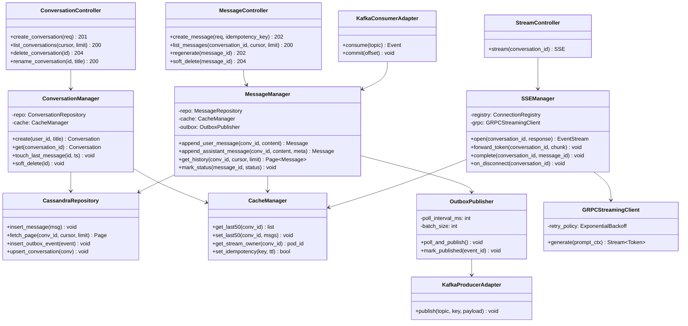
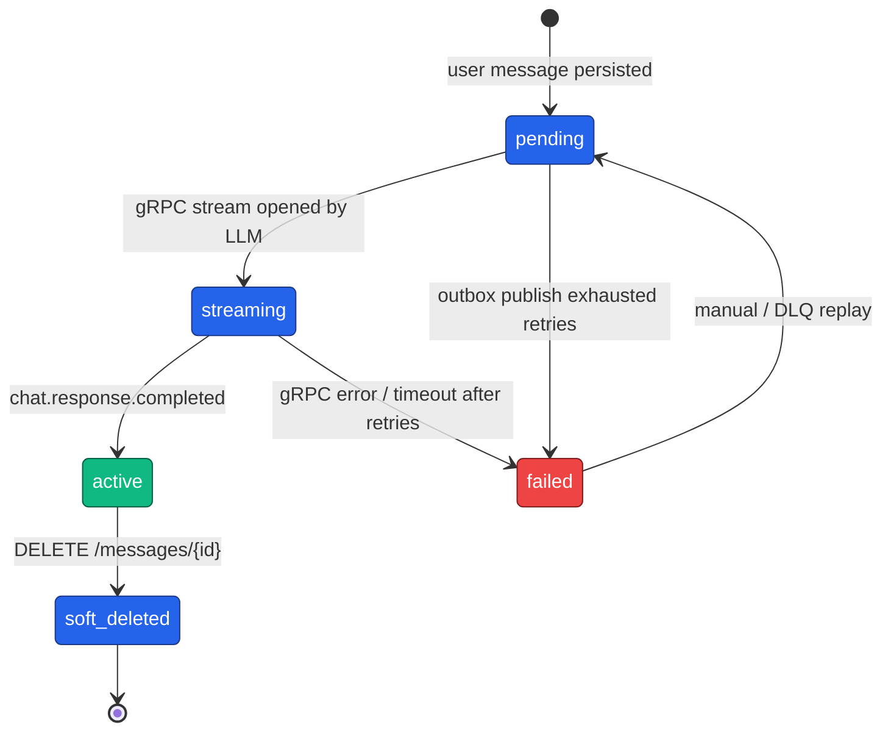
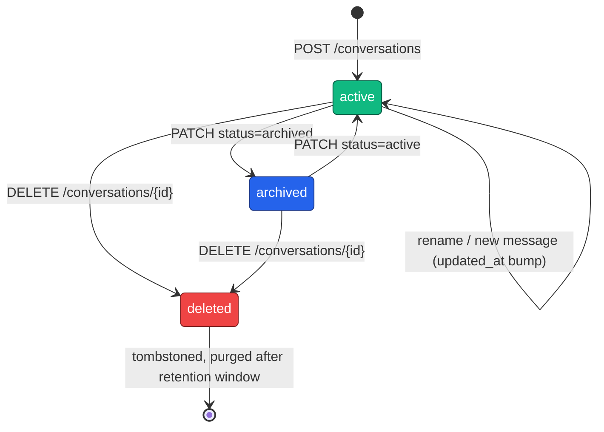
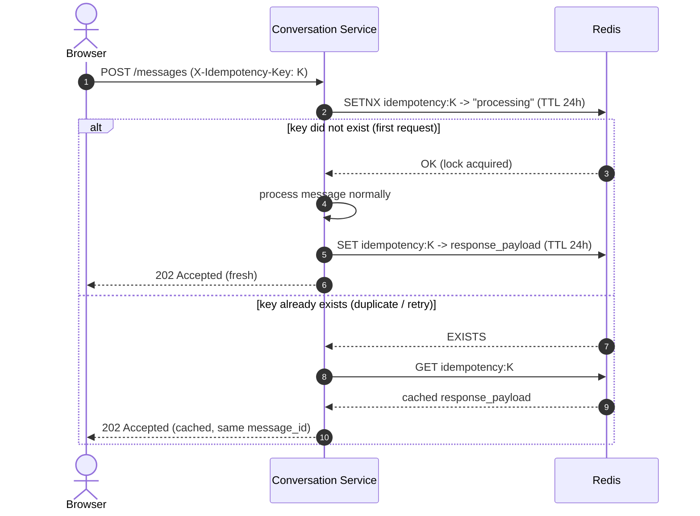
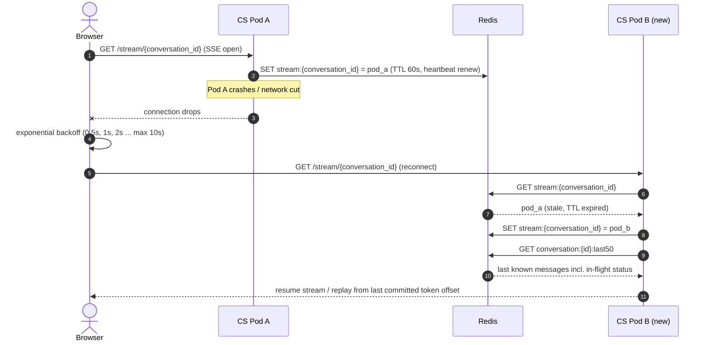
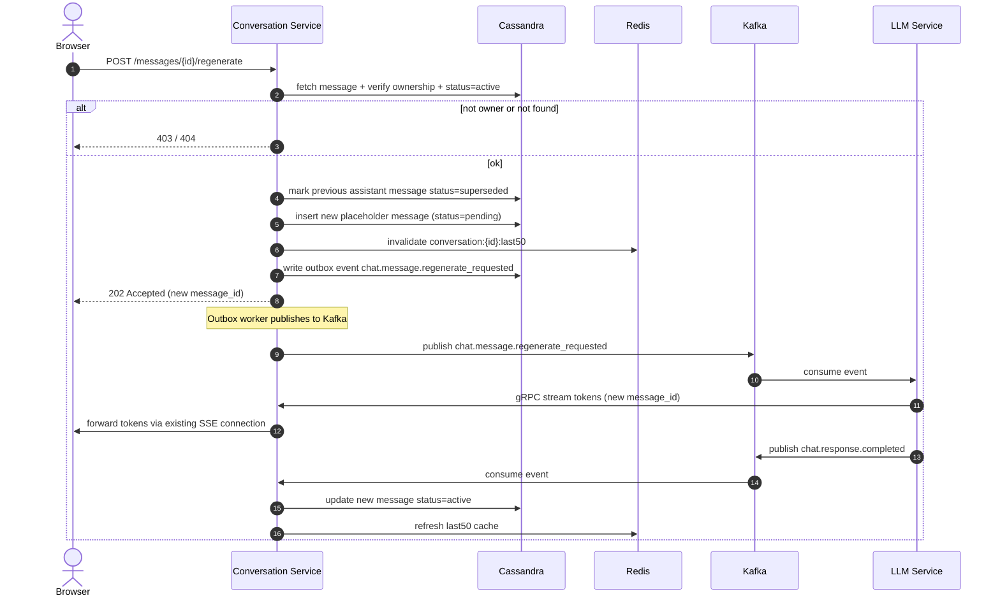
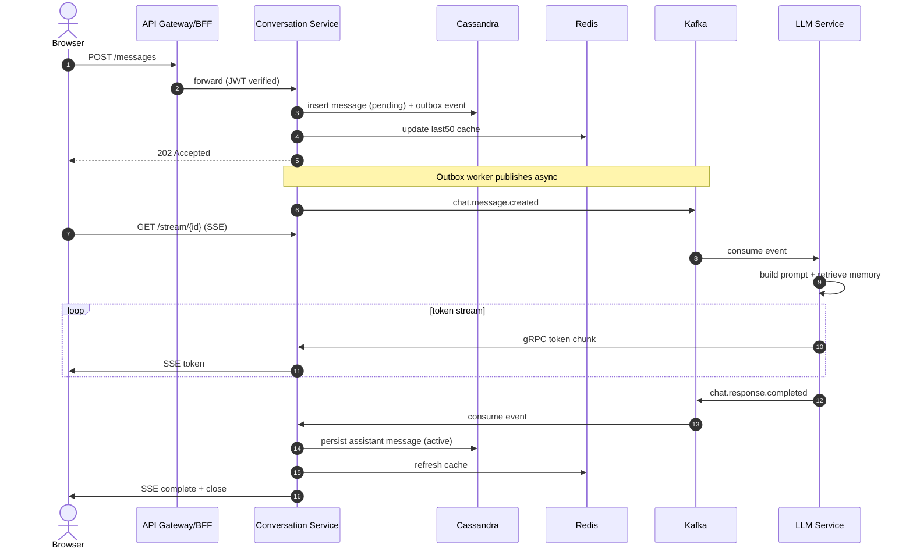

# Conversation Service — Low Level Design (LLD)

**GraphGPT Platform — Production-Scale Engineering Specification**

Companion document to: *Conversation Service — High Level Design*
Document Version 1.0

---

## Table of Contents

1. Purpose & Scope
2. Service Recap (from the HLD)
3. Codebase & Module Structure
4. Internal Component Design
5. State Machines
6. Detailed API Contract
7. Database Layer (Cassandra) — Low Level
8. Cache Layer (Redis) — Low Level
9. Outbox & Inbox Patterns — Detailed Algorithms
10. Idempotency Key Handling
11. Kafka Producer / Consumer — Low Level
12. gRPC Streaming Client — Low Level
13. SSE Connection Manager — Low Level
14. Regenerate Flow — Detailed
15. Error Handling Strategy
16. Concurrency Model
17. Configuration Reference
18. Observability — Low Level
19. Testing Strategy
20. Local Development & Deployment Runbook
21. Appendix

---

# 1. Purpose & Scope

The companion High Level Design (HLD) document establishes **what** the Conversation Service does, which technologies it uses, and **why** (Kafka for business events, Cassandra for message persistence, Redis for transient state, gRPC for LLM token streaming, SSE for browser delivery). This Low Level Design (LLD) goes one level deeper: it defines **how** the service is internally structured — module boundaries, class contracts, exact algorithms, data structures, configuration values, and failure-mode behavior — to the point where an engineering team could implement it without further architectural ambiguity.

### 1.1 What This Document Adds Beyond the HLD

* Concrete module/package layout and dependency direction between internal components.
* Class-level interfaces (method signatures, inputs/outputs, side effects) for every internal component.
* State machines for Message and Conversation lifecycle, with exact transition triggers.
* Field-level API validation rules and a complete HTTP error-code reference.
* Exact CQL statements, consistency levels, and connection-pool configuration for Cassandra.
* Exact Redis key formats, data structures, TTLs, and the cache-aside algorithm in pseudocode.
* The Transactional Outbox and Inbox (deduplication) algorithms written out step by step.
* gRPC client deadlines, retry policy, and backpressure handling.
* SSE connection ownership across pods, heartbeat protocol, and reconnect/resume behavior.
* Concurrency model, environment configuration reference, observability fields, and a test plan.

### 1.2 Non-Goals

* This document does not re-derive capacity planning math (see HLD §12) or repeat the full technology-selection rationale (see HLD §4, §9, §17) — it assumes those decisions as given.
* LLM prompt-construction internals belong to the LLM Service's own LLD, not this one.

---

# 2. Service Recap (from the HLD)

The Conversation Service is the single source of truth for conversation and message state. It never performs LLM inference itself — it persists user messages, publishes a business event, receives generated tokens from the LLM Service over gRPC, and forwards them to the browser over Server-Sent Events (SSE). Kafka is used only for durable, replayable business events (`chat.message.created`, `chat.response.completed`, etc.), not for the token stream itself.

| Concern | Technology | Owned By This Service? |
|---|---|---|
| Conversation/message persistence | Apache Cassandra | Yes — exclusive owner |
| Transient state (cache, locks, idempotency) | Redis | Yes — exclusive owner |
| Business events | Kafka | Yes (producer) / partial (consumer for title & summary events) |
| LLM token generation | LLM Service via gRPC streaming | No — consumed only |
| Browser delivery of tokens | Server-Sent Events (SSE) | Yes — exclusive owner |

---

# 3. Codebase & Module Structure

The directory layout enforces a streamlined architectural layout, segregating components directly under the `app/` package:

```text
conversation-service/
├── app/
│   ├── api/
│   │   ├── deps.py
│   │   ├── router.py
│   │   └── v1/
│   │       ├── conversations.py
│   │       ├── messages.py
│   │       ├── stream.py
│   │       └── health.py
│   ├── core/
│   │   ├── config.py
│   │   ├── security.py
│   │   ├── logging.py
│   │   └── constants.py
│   ├── db/
│   │   ├── cassandra.py
│   │   ├── redis.py
│   │   ├── kafka.py
│   │   └── grpc.py
│   ├── models/
│   │   ├── conversation.py
│   │   ├── message.py
│   │   ├── outbox.py
│   │   └── inbox.py
│   ├── schemas/
│   │   ├── conversation.py
│   │   ├── message.py
│   │   ├── common.py
│   │   └── event.py
│   ├── repositories/
│   │   ├── conversation_repository.py
│   │   ├── message_repository.py
│   │   ├── outbox_repository.py
│   │   └── inbox_repository.py
│   ├── services/
│   │   ├── conversation_service.py
│   │   ├── message_service.py
│   │   ├── stream_service.py
│   │   ├── cache_service.py
│   │   ├── authorization_service.py
│   │   └── idempotency_service.py
│   ├── clients/
│   │   ├── redis_client.py
│   │   ├── kafka_producer.py
│   │   ├── kafka_consumer.py
│   │   ├── grpc_client.py
│   │   └── sse_manager.py
│   ├── workers/
│   │   ├── outbox_worker.py
│   │   ├── retry_worker.py
│   │   ├── cleanup_worker.py
│   │   └── summary_worker.py
│   ├── middleware/
│   │   ├── auth.py
│   │   ├── rate_limit.py
│   │   ├── correlation.py
│   │   └── exception_handler.py
│   ├── events/
│   │   ├── producers.py
│   │   ├── consumers.py
│   │   └── topics.py
│   ├── utils/
│   │   ├── pagination.py
│   │   ├── serialization.py
│   │   ├── validators.py
│   │   └── helpers.py
│   ├── telemetry/
│   │   ├── metrics.py
│   │   └── tracing.py
│   └── main.py
├── tests/
│   ├── unit/
│   ├── integration/
│   └── load/
├── scripts/
├── Dockerfile
├── docker-compose.yml
├── pyproject.toml
├── requirements.txt
└── README.md
```

### 3.1 Package Responsibilities

| Directory | Layer / Component | Rationale & Responsibility |
|---|---|---|
| `app/api/` | Presentation Layer | Exposes HTTP endpoint path handlers (`v1/`), routers, and request dependencies (`deps.py`). |
| `app/core/` | Configuration Layer | Centralizes config loader schemas (`config.py`), constants, telemetry loggers, and security modules. |
| `app/db/` | Database Connections | Manages persistent client drivers initialization (Cassandra, Redis, Kafka, and gRPC). |
| `app/models/` | Domain Entities | Pure Python dataclass structures representing Conversation, Message, Outbox, and Inbox records. |
| `app/schemas/` | DTO Layer | Contains Pydantic validators mapping payload structures, request forms, and serializations. |
| `app/repositories/` | Data Access Repositories | Concrete repository execution logic wrapping SQL statements and key operations. |
| `app/services/` | Business Logic orchestrator | Orchestrates core business use cases (CRUD orchestration, token flow control). |
| `app/clients/` | Client SDK Adapters | Concrete SDK wrapper utilities (gRPC stream reader, aiokafka producer/consumer client loops, SSE managers). |
| `app/workers/` | Background Daemons | Transactional outbox polling threads, failed DLQ retries, and data purgers. |
| `app/middleware/` | Interceptor Hooks | FastAPI request middleware filters (authentication verification, rate limits, correlation logs propagation). |
| `app/events/` | Event Catalog | Maps message serialization types and Kafka topics configurations. |
| `app/utils/` | Shared Helpers | generic formatting utilities (datetime logic, validators, serializers). |
| `app/telemetry/` | Observability Layer | Custom Prometheus instrumentation targets and distributed OpenTelemetry tracers. |
| `app/main.py` | App Entrypoint | FastAPI ASGI startup hooks registration. |

### 3.2 Dependency Rule

> **Business Use-Cases (`services/`) and Domain (`models/`) are kept decoupled from database-specific driver models.** Concrete data access code is decoupled using repository adapters (`repositories/`) and injected at startup. This isolates core business operations from persistence library version changes.

---

# 4. Internal Component Design



### 4.1 Controllers (`api/`)

Controllers are thin: they validate the request shape (Pydantic), extract the authenticated `user_id` from the JWT (attached by auth middleware), and delegate to the corresponding manager in `core/`. No business logic lives here.

| Method | Signature | Behavior |
|---|---|---|
| `ConversationController.create_conversation` | `(req: CreateConversationRequest, user: AuthUser) -> 201` | Delegates to `ConversationManager.create`; returns conversation_id + created_at |
| `ConversationController.list_conversations` | `(cursor: str\|None, limit: int=20, user: AuthUser) -> 200` | Delegates to ConversationManager, enforces limit <= 100 |
| `MessageController.create_message` | `(req: CreateMessageRequest, idempotency_key: str\|None, user: AuthUser) -> 202` | Checks idempotency key in Redis first; delegates to `MessageManager.append_user_message` |
| `MessageController.regenerate` | `(message_id: UUID, user: AuthUser) -> 202` | Verifies ownership + status=active; delegates to MessageManager regenerate flow |
| `StreamController.stream` | `(conversation_id: UUID, user: AuthUser) -> SSE` | Delegates to `SSEManager.open`; keeps connection alive until complete/disconnect |

### 4.2 ConversationManager (`core/`)

```python
class ConversationManager:
    def __init__(self, repo: ConversationRepositoryPort, cache: CachePort): ...

    async def create(self, user_id: UUID, title: str) -> Conversation:
        conv = Conversation.new(user_id, title)
        await self.repo.upsert_conversation(conv)      # conversations + conversations_by_user
        return conv

    async def get(self, conversation_id: UUID, user_id: UUID) -> Conversation:
        conv = await self.cache.get_conversation(conversation_id) \
               or await self.repo.fetch_conversation(conversation_id)
        if conv.user_id != user_id: raise OwnershipError()
        return conv

    async def touch_last_message(self, conversation_id: UUID, ts: datetime) -> None:
        await self.repo.update_updated_at(conversation_id, ts)  # rewrites conversations_by_user row
        await self.cache.invalidate_conversation(conversation_id)
```

### 4.3 MessageManager (`core/`)

```python
class MessageManager:
    def __init__(self, repo: MessageRepositoryPort, cache: CachePort,
                 outbox: OutboxPort): ...

    async def append_user_message(self, conversation_id, content) -> Message:
        msg = Message.new(conversation_id, sender='user', content=content, status='pending')
        await self.repo.insert_message(msg)
        await self.outbox.write_event('chat.message.created', msg.to_event_payload())
        await self.cache.push_last50(conversation_id, msg)
        return msg

    async def get_history(self, conversation_id, cursor, limit=50) -> Page[Message]:
        if cursor is None and (cached := await self.cache.get_last50(conversation_id)):
            return Page(items=cached[:limit], next_cursor=cached[limit-1].message_id if len(cached) > limit else None)
        return await self.repo.fetch_page(conversation_id, cursor, limit)
```

### 4.4 SSEManager (`core/`)

Holds an in-process `ConnectionRegistry` (`dict[conversation_id -> asyncio.Queue]`) and coordinates with Redis so exactly one pod is considered the "owner" of a conversation's active stream at any time (detailed in Chapter 13).

---

# 5. State Machines

## 5.1 Message Lifecycle



| From | To | Trigger |
|---|---|---|
| (none) | pending | User message persisted (POST /messages) |
| pending | streaming | gRPC stream opened after LLM consumes `chat.message.created` |
| streaming | active | `chat.response.completed` consumed, full content persisted |
| streaming | failed | gRPC error/timeout after retry policy exhausted (Ch. 12) |
| pending | failed | Outbox publish retries exhausted (rare — DLQ path) |
| failed | pending | Manual/automated DLQ replay |
| active | soft_deleted | DELETE /messages/{id} |

## 5.2 Conversation Lifecycle



Conversation status is a simple three-state machine (active, archived, deleted). Deletion is always a **soft delete** — a tombstone status flag plus a scheduled purge job — never an immediate hard delete, so that the Outbox/Inbox reconciliation described in Chapter 9 always has a consistent row to operate against.

---

# 6. Detailed API Contract

This expands the HLD's endpoint list with field-level validation and the full error surface. All endpoints require `Authorization: Bearer <JWT>`; the service performs its own fine-grained verification independent of any coarse-grained check the API Gateway may already have done.

### 6.1 POST /messages — Field Validation

| Field | Type | Rule | Failure Response |
|---|---|---|---|
| `conversation_id` | UUID (path/body) | Must exist and be owned by the authenticated user | 404 if not found, 403 if not owner |
| `content` | string | 1–8,000 characters after trim; rejected if empty or only whitespace | 422 Unprocessable Entity |
| `X-Idempotency-Key` | header, UUID | Optional; if present, must be a valid UUIDv4 | 400 if malformed |

### 6.2 Complete Error Code Reference

| HTTP Status | Meaning | Example Cause |
|---|---|---|
| 400 Bad Request | Malformed request syntax | Invalid UUID format, invalid JSON body |
| 401 Unauthorized | Missing/invalid/expired JWT | No Authorization header, signature mismatch |
| 403 Forbidden | Authenticated but not authorized | User does not own the conversation/message |
| 404 Not Found | Resource does not exist | conversation_id / message_id not found |
| 409 Conflict | State conflict | Regenerate requested on a message that is already streaming |
| 422 Unprocessable Entity | Semantically invalid payload | Empty content, content exceeds max length |
| 429 Too Many Requests | Rate limit exceeded | Per-user or per-IP sliding-window limit hit |
| 500 Internal Server Error | Unhandled server fault | Unexpected exception, logged with correlation id |
| 503 Service Unavailable | Downstream dependency down and no fallback available | Cassandra cluster entirely unreachable |

### 6.3 Rate Limiting Rule

Enforced via Redis sliding-window counters keyed `rate:{user_id}`: **60** message-creation requests per rolling 60-second window per user, and **300** read requests per rolling 60-second window per user. Exceeding either returns 429 with a `Retry-After` header computed from the window's remaining TTL.

---

# 7. Database Layer (Cassandra) — Low Level

All access goes through `CassandraRepository`, the only module permitted to import the Cassandra driver. Every query below is a prepared statement, bound and reused across calls to avoid re-parsing overhead.

### 7.1 Driver & Connection Configuration

| Setting | Value | Reason |
|---|---|---|
| Driver | DataStax Python/Java driver (async wrapper) | Token-aware routing, native multi-DC support |
| Load Balancing Policy | `TokenAwarePolicy(DCAwareRoundRobinPolicy(local_dc))` | Routes to replica holding the token, avoids coordinator hop |
| Consistency Level (Writes) | `LOCAL_QUORUM` | Strong local consistency without cross-region latency |
| Consistency Level (Reads) | `LOCAL_QUORUM` (history) / `LOCAL_ONE` (cache-miss fallback) | Balances read-your-writes vs. latency |
| Connection Pool | 2 connections/host (core), 8 max requests per connection | Matches driver defaults tuned for async throughput |
| Statement Timeout | 2000 ms | Fails fast rather than blocking the request thread |
| Retry Policy | `DowngradingConsistencyRetryPolicy` on read timeout only | Avoids retrying writes blindly (non-idempotent risk) |

### 7.2 Repository Method → Exact CQL

```sql
-- insert_message(msg)
INSERT INTO messages_by_conversation
  (conversation_id, message_id, sender, content, created_at, status)
VALUES (?, ?, ?, ?, ?, 'pending')
USING TIMESTAMP ?;                     -- client-side timestamp for LWW correctness

-- fetch_page(conversation_id, cursor, limit)
SELECT message_id, sender, content, created_at, status
FROM messages_by_conversation
WHERE conversation_id = ?
  AND message_id < ?                    -- cursor; omitted clause on first page
LIMIT ?;                                -- clustering order DESC gives latest-first

-- upsert_conversation(conv)
BEGIN BATCH
  INSERT INTO conversations (conversation_id, user_id, title, created_at, updated_at, status)
  VALUES (?, ?, ?, ?, ?, 'active');
  INSERT INTO conversations_by_user (user_id, updated_at, conversation_id, title, created_at, status)
  VALUES (?, ?, ?, ?, ?, 'active');
APPLY BATCH;                            -- logged batch: both tables denormalize the same row
```

### 7.3 Batch Usage Warning

> The logged batch above spans two tables that share the same partition intent (one logical conversation) — this is the one acceptable use of Cassandra batches here. Batches must never be used to write across unrelated partitions purely for "atomicity"; that pattern silently kills write throughput at scale.

---

# 8. Cache Layer (Redis) — Low Level

| Key Pattern | Data Structure | TTL | Written By | Read By |
|---|---|---|---|---|
| `conversation:{id}` | Hash (title, status, updated_at) | 1 hour, refreshed on write | ConversationManager | ConversationManager.get |
| `conversation:{id}:last50` | List (JSON-serialized messages, capped at 50) | 1 hour, refreshed on new message | MessageManager.append_* | MessageManager.get_history |
| `stream:{conversation_id}` | String (pod_id) | 60s, heartbeat-renewed every 20s | SSEManager.open | SSEManager on reconnect |
| `idempotency:{request_id}` | String (cached response JSON or sentinel) | 24 hours | MessageController.create_message | MessageController.create_message (dedupe check) |
| `rate:{user_id}:{bucket}` | Integer counter (INCR + EXPIRE) | 60s sliding window | Rate limit middleware | Rate limit middleware |

### 8.1 Cache-Aside Algorithm (Read Path)

```python
async def get_history(conversation_id, cursor, limit):
    if cursor is None:                          # only the "latest" page is cacheable
        cached = await redis.lrange(f'conversation:{conversation_id}:last50', 0, limit-1)
        if cached:
            record_cache_hit()
            return deserialize(cached)
        record_cache_miss()
    rows = await cassandra_repo.fetch_page(conversation_id, cursor, limit)
    if cursor is None:
        await redis.rpush(f'conversation:{conversation_id}:last50', *serialize(rows))
        await redis.expire(f'conversation:{conversation_id}:last50', 3600)
    return rows
```

### 8.2 Circuit Breaker Around Redis

A circuit breaker wraps every Redis call. After 5 consecutive failures within a 10-second window, the breaker opens for 30 seconds: during this period all cache reads/writes are skipped and requests fall straight through to Cassandra, degrading latency but never availability. A background probe attempts a single `PING` every 30 seconds to decide when to move the breaker to half-open.

---

# 9. Outbox & Inbox Patterns — Detailed Algorithms

### 9.1 Transactional Outbox (Guarantees Zero Message Loss)

```sql
-- outbox table (same keyspace, written in the same logical unit as the message insert)
CREATE TABLE transactional_outbox (
    bucket int,                 -- e.g. hash(event_id) % 32, spreads the poll query
    event_id timeuuid,
    event_type text,
    payload text,                -- JSON
    published boolean,
    created_at timestamp,
    PRIMARY KEY (bucket, event_id)
) WITH CLUSTERING ORDER BY (event_id ASC);
```

### 9.2 OutboxWorker Poll Loop

```python
async def poll_and_publish():
    while True:
        for bucket in range(32):                       # parallelizable across worker instances
            rows = await repo.fetch_unpublished(bucket, limit=200)
            for row in rows:
                try:
                    await kafka_producer.publish(
                        topic=row.event_type,
                        key=row.payload['conversation_id'],  # ordering guarantee
                        value=row.payload,
                    )
                    await repo.mark_published(row.bucket, row.event_id)
                except KafkaTimeoutError:
                    break  # leave unpublished; retry next poll cycle
        await asyncio.sleep(poll_interval_ms / 1000)      # default 250ms
```

The Kafka partition key is always `conversation_id`, guaranteeing that every event for a given conversation is processed in order by a single consumer partition — this is what keeps message ordering correct end to end (see HLD §12, "Kafka partition key").

### 9.3 Inbox Pattern (Deduplicates Kafka Redelivery)

```sql
CREATE TABLE inbox_events (
    event_id uuid PRIMARY KEY,
    processed_at timestamp
) WITH default_time_to_live = 604800;   -- 7-day retention is enough to cover any redelivery window
```

```python
async def handle_event(event):
    if await repo.inbox_exists(event.event_id):
        return  # already processed — skip (at-least-once -> effectively-once)
    await process(event)
    await repo.inbox_insert(event.event_id)
```

---

# 10. Idempotency Key Handling



Redis `SETNX` (`SET key value NX`) provides the atomic "claim this key or fail" primitive needed here. If the client retries a `POST /messages` call (e.g., after a network timeout where the first request actually succeeded), the second request finds the key already set and returns the identical cached response instead of creating a second message.

| Step | Redis Command | Purpose |
|---|---|---|
| 1 | `SET idempotency:{key} "processing" NX EX 86400` | Atomically claim the key; fails if already claimed |
| 2a (won the claim) | `SET idempotency:{key} {response_json} EX 86400` | Overwrite placeholder with the real response once processing completes |
| 2b (lost the claim) | `GET idempotency:{key}` | Return whatever the first request already produced (or 409 if still "processing") |

---

# 11. Kafka Producer / Consumer — Low Level

| Setting | Value | Reason |
|---|---|---|
| Serialization | JSON (Avro considered for v2, schema registry not yet required at current event volume) | Simplicity, human-debuggable payloads |
| Partition key | `conversation_id` | Guarantees per-conversation ordering |
| Producer acks | `acks=all` | Durability — write is only confirmed once all in-sync replicas have it |
| Producer idempotence | `enable.idempotence=true` | Prevents duplicate records from producer-side retries |
| Consumer group id | `conversation-service.chat-events.v1` | Versioned group id allows safe reprocessing on schema change |
| Offset commit | Manual commit after successful handler execution (not auto-commit) | Avoids acknowledging an offset whose side effect didn't complete |
| Max poll records | 50 | Bounds per-batch processing time to stay under session timeout |

### 11.1 Consumed Topics

| Topic | Handler | Idempotency Guard |
|---|---|---|
| `conversation.summary.generated` | `MessageManager.attach_summary` | inbox_events check by event_id |
| `conversation.title.generated` | `ConversationManager.set_title` | inbox_events check by event_id |
| `chat.response.completed` | `MessageManager.finalize_assistant_message` | inbox_events check by event_id |

---

# 12. gRPC Streaming Client — Low Level

### 12.1 Proto Sketch

```protobuf
service GenerationService {
  rpc Generate(GenerationRequest) returns (stream TokenChunk);
}

message GenerationRequest {
  string conversation_id = 1;
  string message_id = 2;
  string prompt_context = 3;   // pre-built by LLM Service's own memory/RAG layer
}

message TokenChunk {
  string message_id = 1;
  string chunk = 2;
  bool is_final = 3;
}
```

### 12.2 Client Configuration

| Setting | Value | Reason |
|---|---|---|
| Deadline per stream | 60 seconds total, reset on each received chunk | Bounds worst-case hang while tolerating slow-but-alive generation |
| Retry policy | 3 attempts, exponential backoff (1s, 2s, 4s) — only before the first chunk is received | Retrying mid-stream would duplicate partial output; only safe pre-first-byte |
| Keepalive | gRPC keepalive ping every 20s, timeout 10s | Detects half-open TCP connections quickly |
| Flow control | Consumer applies backpressure by not calling `next()` until the SSE write buffer drains | Prevents an unbounded in-memory token queue if the browser is slow |

### 12.3 Failure Behavior

If all retries are exhausted before the first token arrives, the stream is aborted, an SSE error event is sent to the browser, and the message is routed to the `chat.message.dlq` Kafka topic for manual/offline recovery (matches HLD §13.3). If the stream fails after some tokens have already been forwarded, the partial content is persisted with `status=failed` rather than `active`, and the same DLQ path is used — never silently discarding partial output.

---

# 13. SSE Connection Manager — Low Level

Because the service is deployed as many stateless pods, and a browser's SSE connection is pinned to exactly one pod at a time, the SSEManager must track — via Redis, not just in-process memory — which pod currently owns the active stream for a given conversation.



### 13.1 Ownership Protocol

* On SSE open: `SET stream:{conversation_id} = {pod_id} EX 60`.
* Heartbeat: every 20 seconds while the connection is open, the owning pod renews the TTL (`EXPIRE stream:{conversation_id} 60`).
* On graceful close: `DEL stream:{conversation_id}`.
* On pod crash: no DEL is sent, so the key simply expires after 60 seconds — the next reconnect claims it.
* On reconnect to a different pod: the new pod overwrites the key with its own pod_id and resumes serving from Redis-cached state (last50 + any in-flight message status).

### 13.2 Client Reconnect Behavior

The browser's `EventSource` (or a thin wrapper around it) retries with exponential backoff — 0.5s, 1s, 2s, 4s, capped at 10s — and always reissues `GET /stream/{conversation_id}`. Because message status (pending/streaming/active) is durable in Cassandra and mirrored in Redis, the reconnecting pod can immediately tell the client whether generation is still in progress, already complete, or failed, rather than the client guessing from a dropped connection.

---

# 14. Regenerate Flow — Detailed



Regeneration never mutates the original assistant message; instead the prior message is marked `superseded` and a new message row is created. This preserves full history (useful for the Memory service and for audit) while still presenting the user with a single "current" answer per turn in the UI.

**Ownership & State Preconditions**
* The caller must own the conversation the message belongs to (403 otherwise).
* The target message must currently be `status=active` (409 Conflict if it is pending/streaming/failed — regeneration only applies to a completed answer).

---

# 15. Error Handling Strategy

* All exceptions raised in `core/` are domain exceptions (`OwnershipError`, `NotFoundError`, `ConflictError`, `ValidationError`) — never raw driver exceptions leaking upward.
* A single FastAPI exception-handler layer maps domain exceptions to the HTTP codes in Chapter 6.2, attaching a `correlation_id` to every error body.
* Unhandled exceptions are caught at the outermost middleware, logged at ERROR with full stack trace + correlation_id, and returned to the client as a generic 500 with no internal detail leaked.
* Every error response body follows the same shape: `{"error": {"code": "...", "message": "...", "correlation_id": "..."}}`.

---

# 16. Concurrency Model

* The service runs on a single asyncio event loop per pod (Uvicorn worker); all I/O (Cassandra, Redis, Kafka, gRPC) uses async drivers so no request thread ever blocks on network I/O.
* CPU-bound work (JSON serialization of large payloads, token counting) is negligible here and stays on the event loop; nothing in this service warrants a separate thread/process pool.
* Per-pod concurrency limits: max 5,000 concurrent SSE connections (enforced by a semaphore; beyond this, new stream requests get 503 and the client retries against another pod via the Ingress) and max 200 in-flight Cassandra requests (bounded by the driver's max-requests-per-connection × connections-per-host).
* Backpressure: if the SSE write buffer for a slow client grows beyond 64KB, the SSEManager pauses reading further gRPC chunks for that stream until the buffer drains (see Chapter 12.2).

---

# 17. Configuration Reference

| Env Var | Default | Description |
|---|---|---|
| `CASSANDRA_CONTACT_POINTS` | cassandra-0,cassandra-1,cassandra-2 | Seed nodes for driver discovery |
| `CASSANDRA_LOCAL_DC` | us-east-1 | Local datacenter for DCAwareRoundRobinPolicy |
| `CASSANDRA_CONSISTENCY_WRITE` | LOCAL_QUORUM | Write consistency level |
| `REDIS_URL` | redis://redis-cluster:6379/0 | Redis Cluster connection string |
| `KAFKA_BROKERS` | kafka-0:9092,kafka-1:9092,kafka-2:9092 | Bootstrap servers |
| `KAFKA_CONSUMER_GROUP` | conversation-service.chat-events.v1 | Versioned consumer group id |
| `OUTBOX_POLL_INTERVAL_MS` | 250 | OutboxWorker poll frequency |
| `OUTBOX_BATCH_SIZE` | 200 | Rows fetched per bucket per poll cycle |
| `GRPC_LLM_SERVICE_ADDR` | llm-service.internal:50051 | LLM Service gRPC endpoint |
| `GRPC_STREAM_DEADLINE_SECONDS` | 60 | Max time per generation stream |
| `SSE_HEARTBEAT_SECONDS` | 20 | TTL-renewal interval for stream:{id} ownership key |
| `RATE_LIMIT_WRITES_PER_MIN` | 60 | Per-user message-creation rate limit |
| `RATE_LIMIT_READS_PER_MIN` | 300 | Per-user read-endpoint rate limit |
| `IDEMPOTENCY_TTL_SECONDS` | 86400 | How long an idempotency key is honored |

---

# 18. Observability — Low Level

### 18.1 Structured Log Fields (every log line)

* `correlation_id` — propagated from the incoming request header (or generated if absent) and forwarded on every downstream call (Kafka header, gRPC metadata).
* `user_id`, `conversation_id`, `message_id` — attached whenever available, never logged with message content.
* `event` — machine-readable event name, e.g. `message.persisted`, `outbox.published`, `sse.reconnected`.
* `duration_ms` — for any operation that talks to Cassandra, Redis, Kafka, or gRPC.

### 18.2 Key Metrics (Prometheus)

| Metric | Type | Labels |
|---|---|---|
| `conversation_service_http_request_duration_seconds` | Histogram | route, method, status_code |
| `conversation_service_sse_active_connections` | Gauge | pod |
| `conversation_service_outbox_lag_seconds` | Gauge | bucket |
| `conversation_service_kafka_consumer_lag` | Gauge | topic, partition |
| `conversation_service_redis_cache_hit_ratio` | Gauge | key_pattern |
| `conversation_service_grpc_stream_duration_seconds` | Histogram | status |

### 18.3 Tracing

Every request creates a root OpenTelemetry span at the API layer; child spans wrap each Cassandra query, Redis call, Kafka publish, and gRPC stream, so a single trace shows exactly where time was spent for any given request — critical for diagnosing tail-latency regressions in production.

---

# 19. Testing Strategy

| Level | Scope | Tooling | Example Cases |
|---|---|---|---|
| Unit | `core/` managers with fake repository/cache/outbox | pytest + fakes/mocks | State-transition correctness, ownership checks, validation rules |
| Integration | Full stack against ephemeral Cassandra/Redis/Kafka | Testcontainers | Outbox publish → Kafka → Inbox dedupe end to end |
| Contract | API request/response schemas | schemathesis / Pydantic schema tests | Every documented error code is actually reachable |
| Load | Throughput & latency under target TPS | k6 / Locust | 57,870 writes/sec peak scenario from HLD §12 |
| Chaos | Failure-mode behavior | Manual fault injection / Chaos Mesh | Kill Redis mid-traffic, kill a Cassandra node, kill a pod mid-SSE-stream |

---

# 20. Local Development & Deployment Runbook

### 20.1 Local Development

A `docker-compose.yml` spins up single-node Cassandra, single-node Redis, and a single-broker Kafka (KRaft mode) alongside the FastAPI app in reload mode, plus a stub LLM Service that echoes tokens back with artificial latency — enough to exercise the full request → outbox → Kafka → gRPC-stream → SSE loop without any cloud dependency.

### 20.2 Deployment Checklist

* Cassandra schema migrations applied (`CREATE TABLE IF NOT EXISTS`, additive only — no destructive migrations without a separate backfill plan).
* Kafka topics pre-created with the partition counts from HLD §12 (chat.message.created, chat.response.completed, etc.).
* Readiness probe (`/ready`) passes — verifies live connectivity to Cassandra, Redis, and Kafka, not just process liveness.
* HPA thresholds and Pod Disruption Budget applied per HLD §17.1 before traffic is shifted.
* Dashboards (Chapter 18 metrics) and alert rules (Kafka consumer lag, outbox lag, SSE connection saturation) are live before rollout completes.

### 20.3 Rollback Plan

Because the service is stateless and all schema changes are additive, rollback is a standard Kubernetes rolling-update revert to the previous image — no data migration reversal is required for typical releases.

---

# 21. Appendix

### A. Related Diagram from the HLD (recap, colorized)



### B. Glossary

| Term | Meaning |
|---|---|
| LLD | Low Level Design — implementation-ready specification of internal structure and algorithms |
| Outbox Pattern | Writes an event to the same store as the business row, published later by a background worker, guaranteeing no event is lost if the message broker is temporarily down |
| Inbox Pattern | Records processed event IDs so at-least-once delivery from Kafka never causes duplicate side effects |
| Cache-Aside | Application checks the cache first, falls back to the database on a miss, and populates the cache afterward |
| Token-Aware Routing | Cassandra driver routes a query directly to the node owning the relevant partition, skipping an extra network hop |
| Backpressure | Slowing or pausing upstream production of data to match a slower consumer's processing rate |