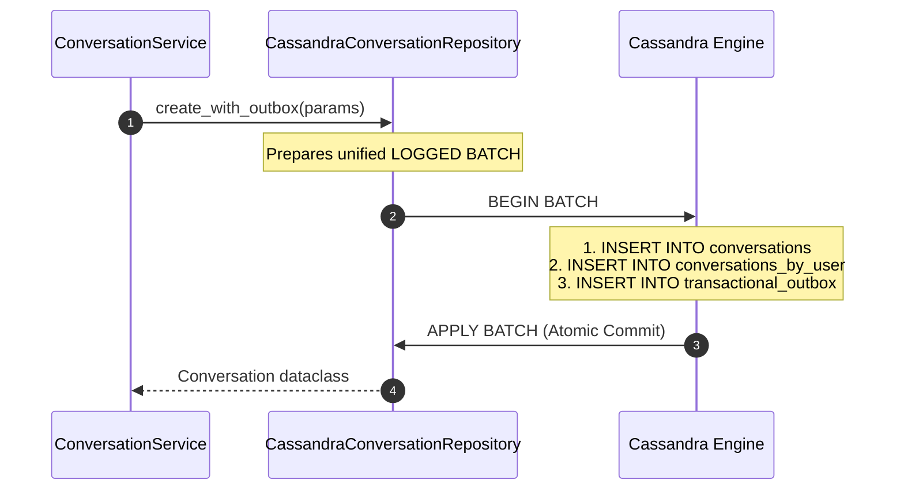

# Task Update 2 — Repository Layer, Atomic Transactional Logged Batches, Service Layer & JWT Authentication Package

This document records the design details, code implementations, architectural optimizations, and testing verification results for **Phases 5, 6, and 7** of the GraphGPT Conversation Service development lifecycle.

---

## Table of Contents

1. Executive Summary
2. Phase 5 — Repository Layer (Cassandra Persistence)
   - 2.1 Repository Architecture & Lazy Prepared Statements
   - 2.2 Cassandra Conversation Repository
   - 2.3 Cassandra Message Repository
   - 2.4 Cassandra Outbox & Inbox Repositories
3. Architectural Innovation — Atomic Transactional Logged Batches
   - 3.1 The Dual-Write Inconsistency Problem
   - 3.2 Atomicity Guarantees with Cassandra Logged Batches
   - 3.3 Unified Batch Prepared Statements
4. Phase 6 — Service Layer & Cache-Aside Architecture
   - 4.1 Conversation Service Business Logic
   - 4.2 Message Service & Redis Cache-Aside Pattern
   - 4.3 Dependency Injection & Factory Methods (`app/api/deps.py`)
5. Phase 7 — Production-Grade JWT Authentication Package (`app/security/`)
   - 5.1 Architecture Decision: Token Consumer vs Issuer
   - 5.2 Package Layout (`app/security/`)
   - 5.3 Strongly Typed `CurrentUser` Model
   - 5.4 JWT Verification Engine
   - 5.5 FastAPI Security Dependencies (`get_current_user`, `require_conversation_owner`)
   - 5.6 Protecting API Endpoints (`app/api/v1/`)
6. Infrastructure & Reliability Engineering
   - 6.1 Kafka Broker ID & ZooKeeper Metadata Alignment
   - 6.2 Cassandra Readiness Polling in `Makefile`
   - 6.3 gRPC Asynchronous Channel Health Check Fix
7. Verification & Testing Strategy
   - 7.1 Automated Unit Tests
   - 7.2 Interactive API Verification & Swagger UI Runbook
8. Summary of Completed Phases & Next Steps

---

## 1. Executive Summary

Phases 5, 6, and 7 establish the core data access, transactional safety, business logic orchestration, and security foundation of the Conversation Service.

- **Phase 5 (Repositories):** Built database access layer adapters for Cassandra (`conversations`, `conversations_by_user`, `messages_by_conversation`, `transactional_outbox`, and `inbox_events`) using lazy prepared statements.
- **Architectural Refactoring (Logged Batches):** Eliminated the dangerous dual-write window between database inserts and outbox event staging by wrapping both into a single atomic Cassandra `LOGGED BATCH`.
- **Phase 6 (Services):** Implemented `ConversationService` and `MessageService` with Redis Cache-Aside caching (`last50` message history list, invalidation on write), decoupled via FastAPI Dependency Injection factory methods.
- **Phase 7 (Security Package):** Refactored JWT authentication into a dedicated, production-grade `app/security/` package. The service strictly acts as a JWT verifier (never mints tokens), extracts identity into a strongly typed `CurrentUser` model, and enforces fine-grained conversation ownership validation (`403 Forbidden` / `404 Not Found`).

---

## 2. Phase 5 — Repository Layer (Cassandra Persistence)

### 2.1 Repository Architecture & Lazy Prepared Statements

The Repository Layer abstracts raw CQL queries away from business logic. Every repository implements lazy statement preparation: prepared statements are compiled on the first execution and cached in an internal dictionary (`_statements`), eliminating query parsing overhead while handling startup driver connection lag gracefully.

```python
# --- Lazy Prepared Statement Pattern ---
def _get_prepared(self, name: str, cql: str):
    """
    Lazily prepares statements to handle connection lag robustly.
    """
    if name not in self._statements:
        session = self.manager.session
        if not session:
            raise RuntimeError("Cassandra database session not available.")
        self._statements[name] = session.prepare(cql)
    return self._statements[name]
```

---

### 2.2 Cassandra Conversation Repository (`app/repositories/conversation_repository.py`)

Handles metadata persistence across both `conversations` (primary lookup by UUID) and `conversations_by_user` (clustering key index sorted by `updated_at DESC`).

```python
class CassandraConversationRepository:
    def __init__(self):
        self.manager = cassandra_manager
        self._statements = {}

    def get(self, conversation_id: UUID) -> Optional[Conversation]:
        cql = """
            SELECT conversation_id, user_id, title, created_at, updated_at, status
            FROM conversations
            WHERE conversation_id = ?
        """
        stmt = self._get_prepared("get_conv", cql)
        row = self.manager.session.execute(stmt, (conversation_id,)).one()
        if not row:
            return None
        return Conversation(
            conversation_id=row.conversation_id,
            user_id=row.user_id,
            title=row.title,
            created_at=row.created_at,
            updated_at=row.updated_at,
            status=ConversationStatus(row.status)
        )

    def list(self, user_id: UUID, limit: int = 20, cursor: Optional[datetime] = None) -> List[Conversation]:
        if cursor:
            cql = """
                SELECT conversation_id, title, created_at, updated_at, status
                FROM conversations_by_user
                WHERE user_id = ? AND updated_at < ?
                LIMIT ?
            """
            stmt = self._get_prepared("list_conv_cursor", cql)
            rows = self.manager.session.execute(stmt, (user_id, cursor, limit))
        else:
            cql = """
                SELECT conversation_id, title, created_at, updated_at, status
                FROM conversations_by_user
                WHERE user_id = ?
                LIMIT ?
            """
            stmt = self._get_prepared("list_conv_no_cursor", cql)
            rows = self.manager.session.execute(stmt, (user_id, limit))

        conversations = []
        for row in rows:
            if row.status == "deleted":
                continue
            conversations.append(Conversation(
                conversation_id=row.conversation_id,
                user_id=user_id,
                title=row.title,
                created_at=row.created_at,
                updated_at=row.updated_at,
                status=ConversationStatus(row.status)
            ))
        return conversations
```

---

### 2.3 Cassandra Message Repository (`app/repositories/message_repository.py`)

Handles chat message persistence in `messages_by_conversation` using microsecond client-side timestamps for Last-Write-Wins (LWW) conflict resolution across distributed replicas.

```python
class CassandraMessageRepository:
    def __init__(self):
        self.manager = cassandra_manager
        self._statements = {}

    def history(self, conversation_id: UUID, limit: int = 50, cursor: Optional[UUID] = None) -> List[Message]:
        if cursor:
            cql = """
                SELECT message_id, sender, content, created_at, status
                FROM messages_by_conversation
                WHERE conversation_id = ? AND message_id < ?
                LIMIT ?
            """
            stmt = self._get_prepared("history_cursor", cql)
            rows = self.manager.session.execute(stmt, (conversation_id, cursor, limit))
        else:
            cql = """
                SELECT message_id, sender, content, created_at, status
                FROM messages_by_conversation
                WHERE conversation_id = ?
                LIMIT ?
            """
            stmt = self._get_prepared("history_no_cursor", cql)
            rows = self.manager.session.execute(stmt, (conversation_id, limit))

        messages = []
        for row in rows:
            if row.status == "deleted":
                continue
            messages.append(Message(
                conversation_id=conversation_id,
                message_id=row.message_id,
                sender=row.sender,
                content=row.content,
                created_at=row.created_at,
                status=MessageStatus(row.status)
            ))
        return messages

    def delete(self, conversation_id: UUID, message_id: UUID) -> bool:
        cql = """
            UPDATE messages_by_conversation
            SET status = 'deleted'
            WHERE conversation_id = ? AND message_id = ?
        """
        stmt = self._get_prepared("delete_msg", cql)
        self.manager.session.execute(stmt, (conversation_id, message_id))
        return True
```

---

### 2.4 Cassandra Outbox & Inbox Repositories

- **Outbox Repository (`app/repositories/outbox_repository.py`):** Saves events into `transactional_outbox` partitioned into 32 buckets (`bucket = hash(event_id) % 32`) to parallelize background polling daemon execution.
- **Inbox Repository (`app/repositories/inbox_repository.py`):** Checks `inbox_events` table for duplicate Kafka event IDs to enforce idempotent consumer execution.

---

## 3. Architectural Innovation — Atomic Transactional Logged Batches

### 3.1 The Dual-Write Inconsistency Problem

In standard Transactional Outbox implementations, developers often execute two separate repository operations:
```python
# --- DANGEROUS DUAL-WRITE WINDOW ---
repo.create(conversation)          # Operation 1: Primary DB Write
outbox_repo.save(outbox_event)     # Operation 2: Outbox DB Write (Process crash here loses event!)
```

If the service crashes, loses network connectivity, or times out between Operation 1 and Operation 2:
1. The conversation is stored in the database.
2. The outbox event is **never created**.
3. Kafka and downstream consumers (e.g. LLM streaming workers) never receive the event, resulting in permanent data drift and message loss.

---

### 3.2 Atomicity Guarantees with Cassandra Logged Batches

To guarantee **Zero Message Loss**, we combined the primary entity modification and the transactional outbox write into a single **Cassandra LOGGED BATCH** (`BEGIN BATCH ... APPLY BATCH`).

Cassandra guarantees that statements inside a Logged Batch execute **atomically**: either all writes in the batch succeed, or none are written.



---

### 3.3 Unified Batch Prepared Statements

#### Conversation Creation Logged Batch (`create_with_outbox`)
```sql
BEGIN BATCH
    INSERT INTO conversations (conversation_id, user_id, title, created_at, updated_at, status)
    VALUES (?, ?, ?, ?, ?, ?);

    INSERT INTO conversations_by_user (user_id, updated_at, conversation_id, title, created_at, status)
    VALUES (?, ?, ?, ?, ?, ?);

    INSERT INTO transactional_outbox (bucket, event_id, event_type, payload, published, created_at)
    VALUES (?, ?, ?, ?, ?, ?);
APPLY BATCH;
```

#### Message Creation Logged Batch (`create_with_outbox`)
```sql
BEGIN BATCH
    INSERT INTO messages_by_conversation (conversation_id, message_id, sender, content, created_at, status)
    VALUES (?, ?, ?, ?, ?, ?)
    USING TIMESTAMP ?;

    INSERT INTO transactional_outbox (bucket, event_id, event_type, payload, published, created_at)
    VALUES (?, ?, ?, ?, ?, ?);
APPLY BATCH;
```

---

## 4. Phase 6 — Service Layer & Cache-Aside Architecture

### 4.1 Conversation Service Business Logic (`app/services/conversation_service.py`)

Coordinates business operations by preparing event payloads and calling single atomic repository methods.

```python
class ConversationService:
    def __init__(self, repo: CassandraConversationRepository):
        self.repo = repo

    def create(self, user_id: UUID, title: str) -> Conversation:
        conversation_id = uuidv7()
        event_id = uuid.uuid1()
        payload = {
            "conversation_id": str(conversation_id),
            "user_id": str(user_id),
            "title": title,
            "status": "active"
        }
        return self.repo.create_with_outbox(
            conversation_id=conversation_id,
            user_id=user_id,
            title=title,
            status="active",
            event_id=event_id,
            event_type=KafkaTopics.CONVERSATION_CREATED,
            outbox_payload=json.dumps(payload)
        )

    def rename(self, conversation_id: UUID, new_title: str) -> Optional[Conversation]:
        conv = self.repo.get(conversation_id)
        if not conv:
            return None
        event_id = uuid.uuid1()
        payload = {
            "conversation_id": str(conversation_id),
            "user_id": str(conv.user_id),
            "title": new_title,
            "status": str(conv.status)
        }
        return self.repo.update_with_outbox(
            conversation_id=conversation_id,
            title=new_title,
            status=conv.status,
            event_id=event_id,
            event_type=KafkaTopics.CONVERSATION_UPDATED,
            outbox_payload=json.dumps(payload)
        )
```

---

### 4.2 Message Service & Redis Cache-Aside Pattern (`app/services/message_service.py`)

Implements **Cache-Aside Caching** for latest message history:
1. **Read Path:** Checks Redis list `conversation:{id}:last50`. On hit, deserializes JSON items. On miss, queries Cassandra, populates Redis with a 1-hour TTL (`EXPIRE`), and returns rows.
2. **Write Path:** On new message creation or deletion, invalidates `conversation:{id}:last50` via `redis.delete()`.

```python
class MessageService:
    def __init__(self, repo: CassandraMessageRepository, redis_client: Optional[aioredis.Redis] = None):
        self.repo = repo
        self.redis = redis_client

    async def _invalidate_cache(self, conversation_id: UUID):
        if self.redis:
            try:
                await self.redis.delete(f"conversation:{conversation_id}:last50")
            except Exception as e:
                logger.warning("Failed to invalidate Redis cache", error=str(e))

    async def send(self, conversation_id: UUID, message_id: UUID, sender: str, content: str) -> Message:
        event_id = uuid.uuid1()
        payload = {
            "conversation_id": str(conversation_id),
            "message_id": str(message_id),
            "sender": sender,
            "content": content,
            "status": "sent"
        }
        msg = self.repo.create_with_outbox(
            conversation_id=conversation_id,
            message_id=message_id,
            sender=sender,
            content=content,
            status="sent",
            event_id=event_id,
            event_type=KafkaTopics.CHAT_MESSAGE_CREATED,
            outbox_payload=json.dumps(payload)
        )
        await self._invalidate_cache(conversation_id)
        return msg
```

---

### 4.3 Dependency Injection & Factory Methods (`app/api/deps.py`)

Uses FastAPI's `Depends` system to inject repository and service instances into request handlers, facilitating clean unit testing through dependency mocking.

```python
def get_conversation_repository() -> CassandraConversationRepository:
    return CassandraConversationRepository()

def get_message_repository() -> CassandraMessageRepository:
    return CassandraMessageRepository()

def get_conversation_service(
    repo: CassandraConversationRepository = Depends(get_conversation_repository)
) -> ConversationService:
    return ConversationService(repo=repo)

def get_message_service(
    repo: CassandraMessageRepository = Depends(get_message_repository)
) -> MessageService:
    return MessageService(repo=repo, redis_client=redis_manager.client)
```

---

## 5. Phase 7 — Production-Grade JWT Authentication Package (`app/security/`)

### 5.1 Architecture Decision: Token Consumer vs Issuer

In a microservice architecture:
- **Auth Service:** Issues and signs JWT tokens.
- **Conversation Service:** Consumes and verifies JWT tokens.
- **Decision:** All token creation logic (`create_jwt_token`) was removed from `app/`. The Conversation Service strictly verifies signatures, claims, expiration, and extracts user identity.

---

### 5.2 Package Layout (`app/security/`)

```text
app/security/
├── __init__.py          # Package interface exports
├── models.py            # CurrentUser Pydantic domain model
├── jwt.py               # Signature, expiration, issuer, audience verification
└── dependencies.py      # get_current_user & require_conversation_owner FastAPI dependencies
```

---

### 5.3 Strongly Typed `CurrentUser` Model (`app/security/models.py`)

Replaced raw dictionaries with a strongly typed Pydantic model constructed directly from claims:

```python
class CurrentUser(BaseModel):
    id: UUID = Field(..., description="Unique UUID identifier of the authenticated user")
    email: Optional[str] = Field(None, description="User email address if present in claims")
    roles: List[str] = Field(default_factory=list, description="Assigned authorization roles")
    scopes: List[str] = Field(default_factory=list, description="Granted permission scopes")

    @classmethod
    def from_jwt_payload(cls, payload: Dict[str, Any]) -> "CurrentUser":
        raw_user_id = payload.get("sub") or payload.get("user_id")
        if not raw_user_id:
            raise HTTPException(
                status_code=status.HTTP_401_UNAUTHORIZED,
                detail="Invalid user identity in token claims",
                headers={"WWW-Authenticate": "Bearer"}
            )
        try:
            user_id = UUID(str(raw_user_id))
        except ValueError:
            raise HTTPException(
                status_code=status.HTTP_401_UNAUTHORIZED,
                detail="Malformed user UUID in token claims",
                headers={"WWW-Authenticate": "Bearer"}
            )
        return cls(
            id=user_id,
            email=payload.get("email"),
            roles=list(payload.get("roles") or []),
            scopes=list(payload.get("scopes") or [])
        )
```

---

### 5.4 JWT Verification Engine (`app/security/jwt.py`)

Verifies signature, expiration (`exp`), issuer (`iss`), and audience (`aud`) claims using PyJWT:

```python
def verify_jwt_token(token: str) -> Dict[str, Any]:
    options = {
        "verify_signature": True,
        "verify_exp": True,
        "verify_iss": bool(settings.JWT_ISSUER),
        "verify_aud": bool(settings.JWT_AUDIENCE)
    }
    try:
        payload = jwt.decode(
            token,
            settings.JWT_SECRET_KEY,
            algorithms=[settings.JWT_ALGORITHM],
            issuer=settings.JWT_ISSUER,
            audience=settings.JWT_AUDIENCE,
            options=options
        )
        return payload
    except jwt.ExpiredSignatureError:
        logger.warning("JWT token signature has expired")
        raise HTTPException(
            status_code=status.HTTP_401_UNAUTHORIZED,
            detail="Authentication token has expired",
            headers={"WWW-Authenticate": "Bearer"}
        )
    except jwt.PyJWTError as e:
        logger.warning("JWT token verification failed", error=str(e))
        raise HTTPException(
            status_code=status.HTTP_401_UNAUTHORIZED,
            detail="Invalid authentication token",
            headers={"WWW-Authenticate": "Bearer"}
        )
```

---

### 5.5 FastAPI Security Dependencies (`app/security/dependencies.py`)

```python
oauth2_scheme = HTTPBearer(auto_error=True)

async def get_current_user(
    credentials: HTTPAuthorizationCredentials = Depends(oauth2_scheme)
) -> CurrentUser:
    token = credentials.credentials
    payload = verify_jwt_token(token)
    return CurrentUser.from_jwt_payload(payload)

async def require_conversation_owner(
    conversation_id: UUID,
    current_user: CurrentUser = Depends(get_current_user),
    service: ConversationService = Depends(get_conversation_service)
) -> Conversation:
    conv = service.repo.get(conversation_id)
    if not conv:
        raise HTTPException(
            status_code=status.HTTP_404_NOT_FOUND,
            detail="Conversation not found"
        )
    if conv.user_id != current_user.id:
        raise HTTPException(
            status_code=status.HTTP_403_FORBIDDEN,
            detail="Forbidden: You do not own this conversation"
        )
    return conv
```

---

### 5.6 Protecting API Endpoints (`app/api/v1/`)

Routes in `conversations.py` and `messages.py` inject security dependencies directly:

```python
@router.post("", response_model=ConversationResponse, status_code=status.HTTP_201_CREATED)
async def create_conversation(
    payload: CreateConversationRequest,
    current_user: CurrentUser = Depends(get_current_user),
    service: ConversationService = Depends(get_conversation_service)
):
    return service.create(user_id=current_user.id, title=payload.title)

@router.get("/{conversation_id}", response_model=ConversationResponse)
async def get_conversation(
    conversation_id: UUID,
    conv: Conversation = Depends(require_conversation_owner)
):
    return conv
```

---

## 6. Infrastructure & Reliability Engineering

During implementation, three critical infrastructure bottlenecks were resolved:

1. **Kafka Broker ID Alignment:**
   - *Problem:* When Kafka started up, partitions for internal topics (`__consumer_offsets`) threw `OfflinePartition` errors because stored `meta.properties` used `broker.id=1001`.
   - *Fix:* Configured `KAFKA_BROKER_ID: 1001` in `docker-compose.yml` to align stored volume partitions.
2. **Cassandra Readiness Automation (`Makefile`):**
   - *Problem:* Running `make schema` immediately after `make infra` caused `ConnectionRefusedError(111)` due to CQL port 9042 initialization lag.
   - *Fix:* Updated `make schema` to run a Python polling loop that checks `cqlsh -e "DESCRIBE KEYSPACES"` up to 30 times (60s timeout) before applying `schema.cql`.
3. **gRPC Health Check Fix (`app/db/grpc.py`):**
   - *Problem:* `grpc.aio` lacks a module-level `channel_ready()` function, raising an `AttributeError`.
   - *Fix:* Replaced with `state = self.channel.get_state(try_to_connect=False)` verifying `state != grpc.ChannelConnectivity.SHUTDOWN`.

---

## 7. Verification & Testing Strategy

### 7.1 Automated Unit Tests

All unit tests pass 100% across repositories, services, and security modules:

```bash
uv run python -m pytest tests/unit/
```

```text
============================= test session starts =============================
platform win32 -- Python 3.12.3, pytest-9.1.1, pluggy-1.6.0
rootdir: C:\Users\hp\Desktop\Granthan\conversation-service
configfile: pyproject.toml
plugins: anyio-4.14.2, asyncio-1.4.0

tests\unit\test_repositories.py ......                                   [ 30%]
tests\unit\test_security.py .........                                    [ 75%]
tests\unit\test_services.py .....                                        [100%]

============================= 20 passed in 1.34s ==============================
```

---

### 7.2 Interactive API Verification & Swagger UI Runbook

- **Swagger UI (`http://localhost:8000/docs`):**
  1. Click **Authorize 🔓** button.
  2. Paste raw test JWT token into **Value** box (without `Bearer ` prefix).
  3. Execute `POST /v1/conversations` -> returns **`201 Created`**.
- **Ready Health Check (`http://localhost:8000/v1/health/ready`):**
  ```json
  {
    "status": "UP",
    "details": {
      "cassandra": "UP",
      "redis": "UP",
      "kafka": "UP",
      "grpc": "UP"
    }
  }
  ```

---

## 8. Summary of Completed Phases & Next Steps

| Phase | Description | Status | Deliverable |
|---|---|---|---|
| **Phase 1** | Project Bootstrap & Python 3.12 Patch | Completed | FastAPI lifespan & config setup |
| **Phase 2** | Core Infrastructure Drivers | Completed | Cassandra, Redis, Kafka, gRPC drivers |
| **Phase 3** | Cassandra Schema Definition | Completed | `schema.cql` & automated CRUD validation |
| **Phase 4** | Domain Models & Helpers | Completed | Native UUIDv7 & Pydantic models |
| **Phase 5** | Repository Layer & Logged Batches | Completed | Cassandra repositories & atomic outbox batches |
| **Phase 6** | Service Layer & Redis Cache-Aside | Completed | `ConversationService` & `MessageService` |
| **Phase 7** | Production JWT Security Package | Completed | `app/security/` package & protected APIs |
| **Phase 8** | REST APIs (Complete Catalog & Messages) | Completed | Protected endpoints in `conversations.py` & `messages.py` |

### Next Steps:
- Implement **Phase 9 — Outbox Worker Daemon** (`app/workers/outbox_worker.py`) to poll `transactional_outbox` and publish events to Kafka.
- Implement **Phase 10 — SSE Connection Manager & gRPC LLM Token Streaming**.
