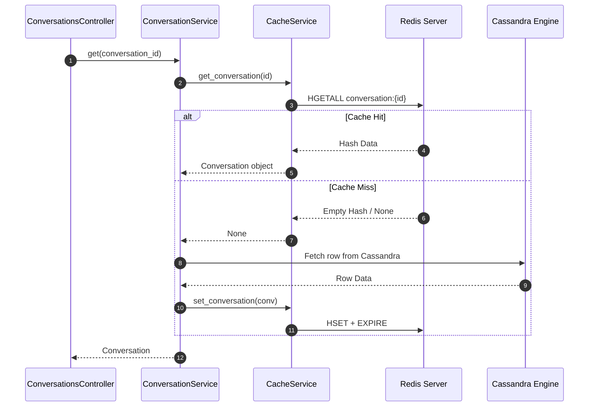

# Task Update 3 — Cursor Pagination & Centralized Caching Service

This document records the completion of **Phases 9 and 10** of the GraphGPT Conversation Service development lifecycle. It details opaque cursor pagination, Cassandra clustering key query optimization, Redis Cache-Aside integration, and the architectural refactoring to a centralized caching service.

---

## 1. Phase 9 — Cursor Pagination

To support seamless infinite scrolling without leaking database schema details or risking URL encoding crashes, we implemented opaque Base64-encoded cursors.

### 1.1 Cursor Serialization & URL-Safety (`app/utils/pagination.py`)
Datetime strings in ISO format contain characters like `+` (which is parsed as a space in query parameters) and `:`. To prevent URL parser corruption, cursors are encoded as URL-safe Base64 strings.

```python
import base64
import json
from typing import Dict, Any

def encode_cursor(payload: Dict[str, Any]) -> str:
    """
    Encodes a dictionary of clustering key attributes into a URL-safe Base64 cursor.
    """
    json_bytes = json.dumps(payload).encode("utf-8")
    return base64.urlsafe_b64encode(json_bytes).decode("utf-8")

def decode_cursor(cursor_str: str) -> Dict[str, Any]:
    """
    Decodes a URL-safe Base64 cursor back into a dictionary of parameters.
    """
    try:
        json_bytes = base64.urlsafe_b64decode(cursor_str.encode("utf-8"))
        return json.loads(json_bytes.decode("utf-8"))
    except Exception:
        raise HTTPException(status_code=400, detail="Invalid pagination cursor format")
```

### 1.2 Cassandra Query Optimization
- **Conversation Feeds (`conversations_by_user`):** Paginated by clustering keys `(updated_at DESC, conversation_id ASC)`. The query filters on `updated_at < ?` using the decoded timestamp cursor.
- **Message Streams (`messages_by_conversation`):** Sorted by clustering key `message_id DESC`. Since `message_id` is a time-ordered UUIDv7, we filter directly on `message_id < ?`.

---

## 2. Phase 10 — Redis Cache & CacheService Refactoring

To enforce separation of concerns and the Single Responsibility Principle, all caching logic was refactored out of business services into a dedicated **`CacheService`** in `app/services/cache_service.py`.

### 2.1 Caching Patterns
1. **Conversation Metadata (`conversation:{id}`):** Cached as a Redis Hash. TTL is set to 1 hour (3600 seconds).
2. **Last 50 Messages (`conversation:{id}:last50`):** Cached as a Redis List of JSON-serialized messages. TTL is set to 1 hour.



### 2.2 Centralized Caching Implementation (`app/services/cache_service.py`)
```python
class CacheService:
    def __init__(self, redis_client: Optional[aioredis.Redis] = None):
        self.redis = redis_client

    async def get_conversation(self, conversation_id: UUID) -> Optional[Conversation]:
        if not self.redis:
            return None
        try:
            cached_data = await self.redis.hgetall(f"conversation:{conversation_id}")
            if cached_data:
                return Conversation(
                    conversation_id=UUID(cached_data["conversation_id"]),
                    user_id=UUID(cached_data["user_id"]),
                    title=cached_data["title"],
                    created_at=datetime.fromisoformat(cached_data["created_at"]),
                    updated_at=datetime.fromisoformat(cached_data["updated_at"]),
                    status=ConversationStatus(cached_data["status"])
                )
        except Exception as e:
            logger.warning("Failed to read from cache", error=str(e))
        return None

    async def set_conversation(self, conv: Conversation) -> None:
        if not self.redis:
            return
        try:
            key = f"conversation:{conv.conversation_id}"
            mapping = {
                "conversation_id": str(conv.conversation_id),
                "user_id": str(conv.user_id),
                "title": conv.title,
                "created_at": conv.created_at.isoformat(),
                "updated_at": conv.updated_at.isoformat(),
                "status": conv.status.value
            }
            await self.redis.hset(key, mapping=mapping)
            await self.redis.expire(key, 3600)
        except Exception as e:
            logger.warning("Failed to write cache", error=str(e))

    async def delete_conversation(self, conversation_id: UUID) -> None:
        if not self.redis:
            return
        try:
            await self.redis.delete(f"conversation:{conversation_id}")
        except Exception as e:
            logger.warning("Failed to invalidate cache", error=str(e))
```

---

## 3. Dependency Injection & Service Factories

Dependency injection is handled at the controller boundary in `app/api/deps.py`:

```python
def get_cache_service() -> CacheService:
    return CacheService(redis_client=redis_manager.client)

def get_conversation_service(
    repo: CassandraConversationRepository = Depends(get_conversation_repository),
    cache_service: CacheService = Depends(get_cache_service)
) -> ConversationService:
    return ConversationService(repo=repo, cache_service=cache_service)

def get_message_service(
    repo: CassandraMessageRepository = Depends(get_message_repository),
    cache_service: CacheService = Depends(get_cache_service)
) -> MessageService:
    return MessageService(repo=repo, cache_service=cache_service)
```

---

## 4. Verification & Testing

### 4.1 Automated Unit Tests
A dedicated suite `tests/unit/test_cache.py` verifies Cache-Aside read-through, write-through, and eviction behavior using mocks.

```bash
uv run python -m pytest tests/unit/
```

```text
============================= test session starts =============================
collected 31 items

tests\unit\test_api.py ....                                              [ 12%]
tests\unit\test_cache.py ....                                            [ 25%]
tests\unit\test_pagination.py ...                                        [ 35%]
tests\unit\test_repositories.py ......                                   [ 54%]
tests\unit\test_security.py .........                                    [ 83%]
tests\unit\test_services.py .....                                        [100%]

======================== 31 passed, 1 warning in 3.00s ========================
```
