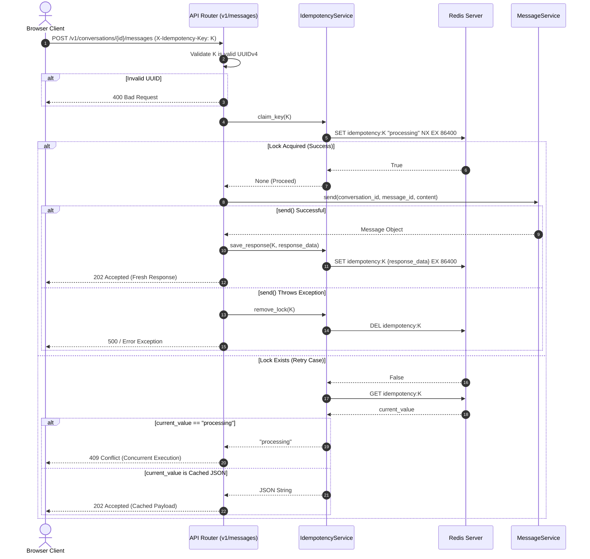

# Task Update 4 — Idempotency Key Handling & Kafka Event Publishing (Detailed)

This document records the complete implementation details, code flows, architectural choices, and verification logs for **Phases 11 and 12** of the GraphGPT Conversation Service.

---

## 1. Phase 11 — HTTP Request Idempotency

To prevent client double-delivery (network retries, client timeouts) from generating duplicate database records, we implemented an HTTP-level idempotency validation framework around message creation (`POST /v1/conversations/{conversation_id}/messages`).

### 1.1 Lock Lifecycle Diagram



### 1.2 Code Implementation: `app/services/idempotency_service.py`
This service isolates Redis `SETNX` commands from the business logic:

```python
class IdempotencyService:
    def __init__(self, redis_client: Optional[aioredis.Redis] = None):
        self.redis = redis_client
        self.ttl = 86400  # 24-hour expiration window

    def _get_key(self, key: str) -> str:
        return f"idempotency:{key}"

    async def claim_key(self, key: str) -> Optional[str]:
        if not self.redis:
            return None
        cache_key = self._get_key(key)
        try:
            # Atomic claim primitive: set only if the key doesn't exist
            acquired = await self.redis.set(cache_key, "processing", nx=True, ex=self.ttl)
            if acquired:
                logger.info("Idempotency lock acquired", key=key)
                return None
            
            # Key already exists, fetch its current state
            current_value = await self.redis.get(cache_key)
            return current_value
        except Exception as e:
            logger.warning("Failed to check/claim idempotency key in Redis", key=key, error=str(e))
            return None

    async def save_response(self, key: str, response_payload: Dict[str, Any]) -> None:
        if not self.redis:
            return
        cache_key = self._get_key(key)
        try:
            payload_str = json.dumps(response_payload)
            await self.redis.set(cache_key, payload_str, ex=self.ttl)
        except Exception as e:
            logger.warning("Failed to save idempotency response in Redis", key=key, error=str(e))

    async def remove_lock(self, key: str) -> None:
        if not self.redis:
            return
        cache_key = self._get_key(key)
        try:
            await self.redis.delete(cache_key)
            logger.info("Idempotency lock evicted due to failure", key=key)
        except Exception as e:
            logger.warning("Failed to remove idempotency lock in Redis", key=key, error=str(e))
```

### 1.3 Endpoint Integration: `app/api/v1/messages.py`
In `create_message`, the flow extracts `X-Idempotency-Key` and routes the request state appropriately:

```python
    if x_idempotency_key:
        # 1. Validate UUID format
        try:
            uuid.UUID(x_idempotency_key)
        except ValueError:
            raise HTTPException(
                status_code=status.HTTP_400_BAD_REQUEST,
                detail="X-Idempotency-Key must be a valid UUIDv4"
            )

        # 2. Check lock status
        lock_status = await idempotency_service.claim_key(x_idempotency_key)
        if lock_status == "processing":
            raise HTTPException(
                status_code=status.HTTP_409_CONFLICT,
                detail="A concurrent request with this idempotency key is already in progress"
            )
        elif lock_status is not None:
            # Lock has finished, return the cached result
            cached_data = json.loads(lock_status)
            return MessageResponse(
                message_id=UUID(cached_data["message_id"]),
                conversation_id=UUID(cached_data["conversation_id"]),
                sender=cached_data["sender"],
                content=cached_data["content"],
                created_at=datetime.fromisoformat(cached_data["created_at"]),
                status=cached_data["status"]
            )
```

---

## 2. Phase 12 — Kafka Event Publishing

To support downstream services (like LLM stream generation, semantic indexers, and summarization workers), events are published directly to Kafka immediately following database write synchronization.

### 2.1 Partition Ordering Strategy
To ensure all lifecycle events for a specific conversation are consumed sequentially and in order, we use the string-formatted `conversation_id` as the **Kafka Partition Routing Key**. In Kafka, messages with the same partition key are guaranteed to land on the same broker partition, preserving execution logs order.

### 2.2 Event Types & Dispatched Payloads
1. **`conversation.created`** (Topic: `conversation.created`)
   - Dispatched from: `ConversationService.create`
   - Schema:
     ```json
     {
       "conversation_id": "019fa936-f20a-7700-acde-85be4d694a0b",
       "user_id": "ae8d5d77-05a4-4506-96ec-f54839091d39",
       "title": "Physics Title",
       "status": "active"
     }
     ```
2. **`conversation.updated`** (Topic: `conversation.updated`)
   - Dispatched from: `ConversationService.rename` & `ConversationService.archive`
   - Schema (contains latest attributes):
     ```json
     {
       "conversation_id": "019fa936-f20a-7700-acde-85be4d694a0b",
       "user_id": "ae8d5d77-05a4-4506-96ec-f54839091d39",
       "title": "New Title",
       "status": "active"
     }
     ```
3. **`conversation.deleted`** (Topic: `conversation.deleted`)
   - Dispatched from: `ConversationService.delete`
   - Schema:
     ```json
     {
       "conversation_id": "019fa936-f20a-7700-acde-85be4d694a0b",
       "user_id": "ae8d5d77-05a4-4506-96ec-f54839091d39",
       "title": "Physics Title",
       "status": "deleted"
     }
     ```
4. **`chat.message.created`** (Topic: `chat.message.created`)
   - Dispatched from: `MessageService.send` (user prompt) & `MessageService.regenerate` (assistant trigger)
   - User Message Payload:
     ```json
     {
       "conversation_id": "019fa936-f20a-7700-acde-85be4d694a0b",
       "message_id": "019fa94c-8822-7711-bcde-99f43210abcd",
       "sender": "user",
       "content": "Hello world",
       "status": "sent"
     }
     ```
   - Regenerate Payload (assistant pending notification):
     ```json
     {
       "conversation_id": "019fa936-f20a-7700-acde-85be4d694a0b",
       "message_id": "019fa94e-2ada-46e2-be2c-8a62d612ef1c",
       "sender": "assistant",
       "content": "",
       "prompt_content": "Hello world",
       "status": "pending"
     }
     ```

---

## 3. Dependency Injection Architecture

All components are wired dynamically via constructor injection inside `app/api/deps.py`:

```python
def get_kafka_producer_client() -> KafkaProducerClient:
    return kafka_producer_client

def get_conversation_service(
    repo: CassandraConversationRepository = Depends(get_conversation_repository),
    cache_service: CacheService = Depends(get_cache_service),
    producer_client: KafkaProducerClient = Depends(get_kafka_producer_client)
) -> ConversationService:
    return ConversationService(repo=repo, cache_service=cache_service, producer_client=producer_client)
```

By decoupling imports, tests mock services easily:
```python
# Unit testing mock setups
service = ConversationService(repo=mock_repo, producer_client=mock_producer)
```

---

## 4. Verification

### 4.1 Test Run Logs
The pytest unit test suite validates and checks every logic path:
```bash
uv run python -m pytest tests/unit/
```
```text
============================= test session starts =============================
platform win32 -- Python 3.12.3, pytest-9.1.1, pluggy-1.6.0
rootdir: C:\Users\hp\Desktop\Granthan\conversation-service
configfile: pyproject.toml
plugins: anyio-4.14.2, asyncio-1.4.0
asyncio: mode=Mode.STRICT, debug=False
collected 39 items

tests\unit\test_api.py ....                                              [ 10%]
tests\unit\test_cache.py ....                                            [ 20%]
tests\unit\test_idempotency.py .....                                     [ 33%]
tests\unit\test_kafka.py ...                                             [ 41%]
tests\unit\test_pagination.py ...                                        [ 48%]
tests\unit\test_repositories.py ......                                   [ 64%]
tests\unit\test_security.py .........                                    [ 87%]
tests\unit\test_services.py .....                                        [100%]

======================== 39 passed, 1 warning in 3.09s ========================
```

### 4.2 Stream monitoring in Makefile
We updated the log tailing scripts in `Makefile` to target `/opt/kafka/bin/kafka-console-consumer.sh` inside the docker image:
```makefile
kafka-log-msg-created:
	docker exec -it graphgpt-kafka /opt/kafka/bin/kafka-console-consumer.sh --bootstrap-server localhost:9092 --topic chat.message.created --from-beginning
```
