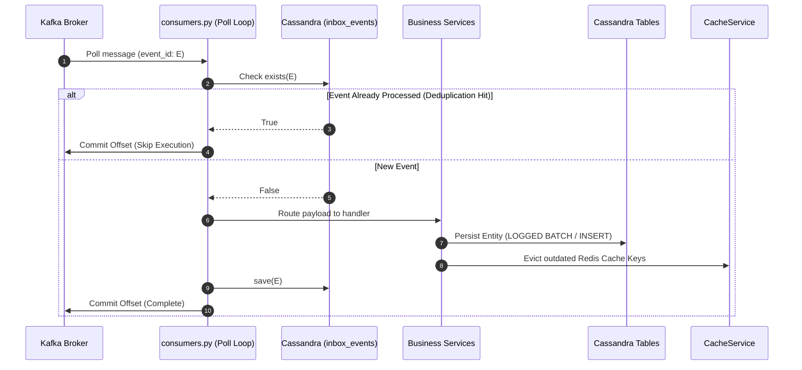

# Task Update 5 — Kafka Consumer & Inbound Event Processing

This document records the complete implementation details, code flows, architectural choices, and verification logs for **Phase 13** of the GraphGPT Conversation Service.

---

## 1. Phase 13 — Kafka Inbound Event Processing

To decouple the core microservice from downstream generation pipelines (LLMs, Memory Agents, and Title Extractors), we implemented a background Kafka Consumer loop that processes async callbacks.

### 1.1 Inbound Consumer Flow



---

## 2. Inbound Topic Mappings & Handlers

### 2.1 Title Generated (`conversation.title.generated`)
- **Publisher**: LLM Service (Friendly title generation once conversation starts).
- **Handler**: `ConversationService.set_title`
- **Database Write**: `CassandraConversationRepository.update_title` (Atomically deletes the old `conversations_by_user` index and inserts the new index with updated time cluster sorting, while updating the main `conversations` catalog).
- **Cache Policy**: Evict/delete `conversation:{conversation_id}` from Redis.

### 2.2 Chat Response Completed (`chat.response.completed`)
- **Publisher**: AI worker (Streaming completed response notification).
- **Handler**: `MessageService.finalize_assistant_message`
- **Database Write**: `CassandraMessageRepository.create_message_direct` (Inserts the assistant's final response content with `status='sent'` directly without staging new outbox events).
- **Cache Policy**: Evict/delete list `conversation:{conversation_id}:last50`.

### 2.3 Conversation Summary Generated (`conversation.summary.generated`)
- **Publisher**: Memory Service (Periodic summary indexing of chat sessions).
- **Handler**: `MessageService.attach_summary`
- **Database Write**: `CassandraMessageRepository.create_message_direct` (Inserts a special message log with `sender='system'` containing the summarized content).
- **Cache Policy**: Evict/delete list `conversation:{conversation_id}:last50`.

---

## 3. Lifespan Coordination (`app/main.py`)

The consumer is instantiated and polled inside a background asyncio Task linked directly to the FastAPI lifespan startup/shutdown lifecycle hooks:

```python
@asynccontextmanager
async def lifespan(app: FastAPI):
    # Startup phase...
    await kafka_manager.initialize()
    
    # Spawn background consumer task
    app.state.kafka_consumer_task = asyncio.create_task(start_kafka_consumer())
    
    yield
    # Shutdown phase...
    app.state.kafka_consumer_task.cancel()
    try:
        await app.state.kafka_consumer_task
    except asyncio.CancelledError:
        pass
```

---

## 4. Verification

### 4.1 Unit Tests
A dedicated suite `tests/unit/test_consumers.py` verifies correct JSON decoding, Inbox deduplication checks, routing logic, and offset commits.

```bash
uv run python -m pytest tests/unit/
```
```text
============================= test session starts =============================
platform win32 -- Python 3.12.3, pytest-9.1.1, pluggy-1.6.0
rootdir: C:\Users\hp\Desktop\Granthan\conversation-service
configfile: pyproject.toml
plugins: anyio-4.14.2, asyncio-1.4.0
asyncio: mode=Mode.STRICT, debug=False
collected 43 items

tests\unit\test_api.py ....                                              [  9%]
tests\unit\test_cache.py ....                                            [ 18%]
tests\unit\test_consumers.py ....                                        [ 27%]
tests\unit\test_idempotency.py .....                                     [ 39%]
tests\unit\test_kafka.py ...                                             [ 46%]
tests\unit\test_pagination.py ...                                        [ 53%]
tests\unit\test_repositories.py ......                                   [ 67%]
tests\unit\test_security.py .........                                    [ 88%]
tests\unit\test_services.py .....                                        [100%]

======================== 43 passed, 1 warning in 2.13s ========================
```
