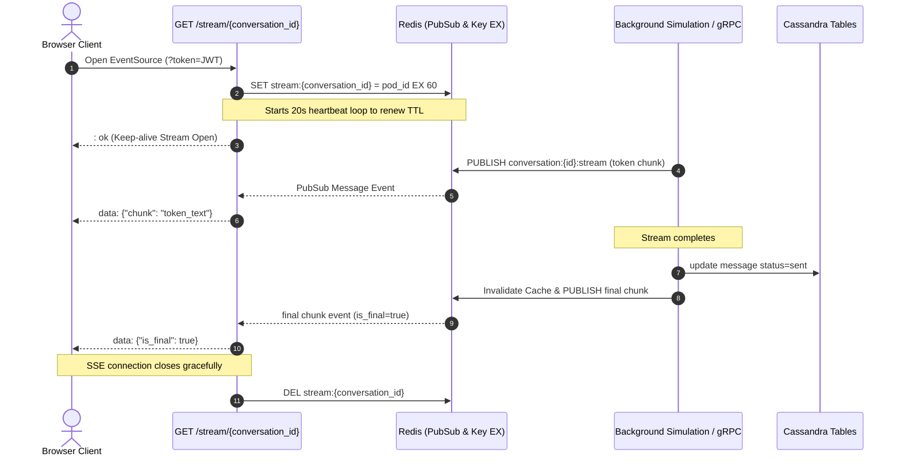

# Task Update 6 — SSE Streaming & Connection Management

This document records the complete implementation details, code flows, architectural choices, and verification logs for **Phase 14** of the GraphGPT Conversation Service.

---

## 1. Phase 14 — SSE Real-Time Streaming Architecture

To support real-time token streaming to user browsers while maintaining stateless, multi-pod horizontal scalability, we implemented a decoupled Redis PubSub streaming pipeline.



---

## 2. Low-Level Component Specifications

### 2.1 Authenticating EventSource Queries (`app/security/dependencies.py`)
Because the browser's standard `EventSource` API does not support custom request headers (such as `Authorization: Bearer <token>`), the connection query credentials must be passed via URL arguments.
We updated `get_current_user` to inspect query strings as a fallback:

```python
async def get_current_user(
    credentials: Optional[HTTPAuthorizationCredentials] = Depends(oauth2_scheme),
    token: Optional[str] = Query(None)
) -> CurrentUser:
    resolved_token = credentials.credentials if credentials else token
    # Validate and decode resolved_token...
```

### 2.2 Connection Management & Heartbeats (`app/services/stream_service.py`)
- **Ownership locks**: Each process generates a distinct `pod_id` (e.g. `pod_a1b2c3d4`). When a client connects, the service writes `stream:{conversation_id} = {pod_id} EX 60` to track the connection owner.
- **Heartbeats**: Every 20 seconds, a background asyncio task updates the expiration to 60 seconds (`EXPIRE`). The connection loop periodically writes standard SSE comments (`: heartbeat`) to ensure proxies/routers do not sever the connection.
- **Graceful Disconnects**: On client connection termination, the subscription terminates, heartbeats cancel, and the service deletes (`DEL`) the ownership key from Redis.

### 2.3 Redis PubSub Integration
All token chunks are published to `conversation:{conversation_id}:stream`. The SSE endpoint subscribes to this channel, converting internal JSON payloads into SSE standard formats (`data: <json>\n\n`).

---

## 3. Verification

### 3.1 Unit Tests
A dedicated suite `tests/unit/test_stream.py` checks Redis ownership registration/renew/release, token publishing, connection authentication, and SSE payload emission.

```bash
uv run python -m pytest tests/unit/
```
```text
============================= test session starts =============================
platform win32 -- Python 3.12.3, pytest-9.1.1, pluggy-1.6.0
rootdir: C:\Users\hp\Desktop\Granthan\conversation-service
configfile: pyproject.toml
plugins: anyio-4.14.2, asyncio-1.4.0
asyncio: mode=Mode.STRICT, debug=False
collected 49 items

tests\unit\test_api.py ....                                              [  8%]
tests\unit\test_cache.py ....                                            [ 16%]
tests\unit\test_consumers.py ....                                        [ 24%]
tests\unit\test_idempotency.py .....                                     [ 34%]
tests\unit\test_kafka.py ...                                             [ 40%]
tests\unit\test_pagination.py ...                                        [ 46%]
tests\unit\test_repositories.py ......                                   [ 59%]
tests\unit\test_security.py .........                                    [ 77%]
tests\unit\test_services.py .....                                        [ 87%]
tests\unit\test_stream.py ......                                         [100%]

======================== 49 passed, 1 warning in 3.29s ========================
```
