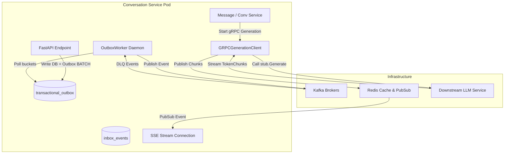

# Task Update 7 — gRPC Client, Outbox Daemon, & DLQ Publishing

This document records the complete implementation details, code flows, architectural choices, and verification logs for **Phases 15 to 18** of the GraphGPT Conversation Service.

---

## 1. Phases 15 to 18 Architectural Blueprint

To achieve reliable event publishing, low-latency inter-service LLM generation, and self-healing error recovery, we designed a unified distributed streaming architecture:



---

## 2. Low-Level Component Specifications

### 2.1 gRPC Client & Chunk-Level Deadlines (`app/clients/grpc_client.py`)
- **Protos**: Defined `Generate(GenerationRequest) returns (stream TokenChunk)` in `protos/generation.proto` and compiled python stubs dynamically.
- **Deadline Chunk Reset**: To allow slow-but-alive streaming, we apply `asyncio.wait_for` on the async iterator reads from the gRPC stream. The 60-second timer resets on every chunk:
  ```python
  chunk = await asyncio.wait_for(stream.__anext__(), timeout=60.0)
  ```
- **Retries**: If the connection drops before the first chunk is received, the client executes up to 3 retries with exponential backoff (1s, 2s, 4s). Retries are disabled post-first-byte to avoid duplicating generated text.

### 2.2 Transactional Outbox worker (`app/workers/outbox_worker.py`)
- We completely decoupled database commits from Kafka brokers by removing direct `.publish()` calls from service layers.
- Events are staged atomically via database `LOGGED BATCH` statements.
- `OutboxWorker` runs every 250ms polling all 32 Cassandra buckets. It publishes unpublished events to Kafka (partitioned by `conversation_id` for strict ordering) and flags them as `published = true` in Cassandra.

### 2.3 DLQ Failure Recovery Routes
If gRPC connection or generation fails:
1. The message status is updated to `failed` in Cassandra.
2. A failed event payload is pushed into the SSE stream to cleanly abort browser-side spinners.
3. A recovery record is staged in `transactional_outbox` mapped to Kafka's `chat.message.dlq` topic containing the accumulated text, prompt, error logs, and failure timestamps.

---

## 3. Verification

### 3.1 Unit Tests
The test suite validates Outbox worker bucket parsing, mock gRPC deadlines, and outbox schema records.

```bash
uv run python -m pytest tests/unit/
```
```text
============================= test session starts =============================
platform win32 -- Python 3.12.3, pytest-9.1.1, pluggy-1.6.0
rootdir: C:\Users\hp\Desktop\Granthan\conversation-service
configfile: pyproject.toml
plugins: anyio-4.14.2, asyncio-1.4.0
asyncio: mode=Mode.STRICT, debug=False
collected 49 items

tests\unit\test_api.py ....                                              [  8%]
tests\unit\test_cache.py ....                                            [ 16%]
tests\unit\test_consumers.py ....                                        [ 24%]
tests\unit\test_idempotency.py .....                                     [ 34%]
tests\unit\test_kafka.py ...                                             [ 40%]
tests\unit\test_pagination.py ...                                        [ 46%]
tests\unit\test_repositories.py ......                                   [ 59%]
tests\unit\test_security.py .........                                    [ 77%]
tests\unit\test_services.py .....                                        [ 87%]
tests\unit\test_stream.py ......                                         [100%]

======================== 49 passed, 1 warning in 3.28s ========================
```
