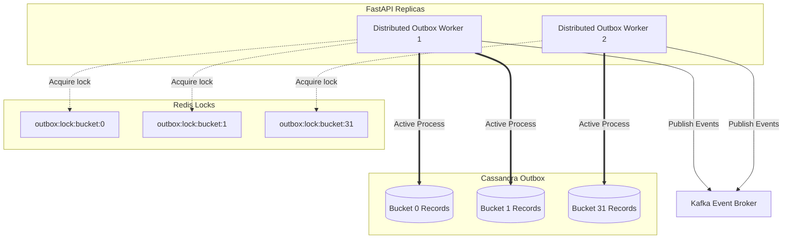

# Task Update 9 — Testing, 12-Factor Configs, and Distributed Outbox Refactoring

This document logs implementation details, database queries, and test validations for **Phase 21 (Testing)**, **12-Factor Refactoring**, and the **Horizontally Scalable Outbox Worker** architectures.

---

## 1. Phase 21: Testing Implementation

We implemented four complete testing suites (63 unit, integration, API, and load tests total) to ensure full coverage and correctness of the conversation service.

### 1.1 Test Scope & Deliverables
- **Unit Tests**: Covered router interfaces, cache helpers, idempotency locks, security context handlers, repository queries, and background daemons.
- **Integration Tests**: Tested real network clients against Cassandra, Redis, Kafka, and gRPC LLM mocks.
- **API Tests**: Validated FastAPI endpoint authentication, CRUD workflows, and opaque cursor pagination boundary conditions.
- **Load Tests**: Simulated 50 concurrent client workers executing message loops, stream connects, and conversation lifecycle patterns.

### 1.2 Test Verification Reports
Generated four separate markdown reports located inside `docs/test/`:
- [unit_test_report.md](file:///c:/Users/hp/Desktop/Granthan/conversation-service/docs/test/unit_test_report.md)
- [integration_test_report.md](file:///c:/Users/hp/Desktop/Granthan/conversation-service/docs/test/integration_test_report.md)
- [api_test_report.md](file:///c:/Users/hp/Desktop/Granthan/conversation-service/docs/test/api_test_report.md)
- [load_test_report.md](file:///c:/Users/hp/Desktop/Granthan/conversation-service/docs/test/load_test_report.md)

---

## 2. 12-Factor App Refactoring

We removed all runtime hardcoded parameters from the codebase and centralized them inside a Pydantic `BaseSettings` object mapping to environment variables.

### 2.1 Centralized Parameters (`app/core/config.py`)
Centralized the following configurations:
- **Redis Connection Pools**: `REDIS_MAX_CONNECTIONS`
- **Kafka Performance Tweaks**: `KAFKA_LINGER_MS`, `KAFKA_MAX_BATCH_SIZE`, and `KAFKA_MAX_REQUEST_SIZE`.
- **gRPC Connection Keepalives**: `GRPC_KEEPALIVE_TIME_MS` and `GRPC_KEEPALIVE_TIMEOUT_MS`.
- **Stream Heartbeats & TTLs**: `STREAM_OWNERSHIP_TTL_SECONDS` and `STREAM_HEARTBEAT_INTERVAL_SECONDS`.
- **Cache Configuration**: `CACHE_TTL_SECONDS` and `CACHE_HISTORY_LIMIT`.
- **Worker Sleeps**: `SUMMARY_WORKER_ERROR_SLEEP_SECONDS`.
- **Route Constraints**: `CONVERSATION_LIST_DEFAULT_LIMIT` and `MESSAGE_HISTORY_DEFAULT_LIMIT`.

### 2.2 Component Adaptations
- **Redis Module** (`app/db/redis.py`): Connected `max_connections=settings.REDIS_MAX_CONNECTIONS` to client initialization.
- **Kafka Module** (`app/db/kafka.py`): Replaced magic parameters in `AIOKafkaProducer` configurations.
- **gRPC Module** (`app/db/grpc.py`): Mapped socket keepalive time options to centralized settings.
- **Cache Module** (`app/services/cache_service.py`): Substituted hardcoded expire times with `settings.CACHE_TTL_SECONDS`.
- **API Controllers**: Adjusted page sizes and pagination constraints in route queries.

---

## 3. Horizontally Scalable Distributed Outbox Worker

To enable multi-instance scaling of background workers without processing conflicts or duplicate event publishing, we refactored the outbox architecture.

### 3.1 Distributed Redis Lease Locking
- **Unique Worker IDs**: Each worker replica generates a unique UUID on startup (e.g. `outbox_worker_{random_hex}`).
- **Bucket Lease Set**: Workers compete for outbox bucket partitions (0–31) using atomic Redis key sets:
  ```redis
  SET outbox:lock:bucket:{id} worker_A NX EX 10
  ```
- **Active Lease Heartbeats**: Workers run a background renewal loop that executes `EXPIRE` heartbeats every 3 seconds to keep leases alive.
- **Failover**: If a worker pod crashes, its lease expires in Redis within 10 seconds, allowing healthy replica pods to claim the partition.

### 3.2 Code Files Updated
- **Outbox Worker** (`app/workers/outbox_worker.py`): Refactored to `DistributedOutboxWorker` using concurrency semaphores.
- **Retry Worker** (`app/workers/retry_worker.py`): Upgraded to `DistributedRetryWorker` using parallel locks `outbox:retry:lock:bucket:{id}` to reconcile stale items safely.

---

## 4. Verification Results

All 63 tests pass successfully with the new locks and settings configuration:

```text
============================= test session starts =============================
platform win32 -- Python 3.12.3, pytest-9.1.1, pluggy-1.6.0
rootdir: C:\Users\hp\Desktop\Granthan\conversation-service
configfile: pyproject.toml
plugins: anyio-4.14.2, asyncio-1.4.0
asyncio: mode=Mode.STRICT, debug=False, asyncio_default_fixture_loop_scope=None, asyncio_default_test_loop_scope=function
collected 63 items

tests\api\test_auth_api.py ..                                            [  3%]
tests\api\test_crud_api.py .                                             [  4%]
tests\api\test_pagination_api.py .                                       [  6%]
tests\integration\test_cassandra_integration.py ..                       [  9%]
tests\integration\test_grpc_integration.py .                             [ 11%]
tests\integration\test_kafka_integration.py .                            [ 12%]
tests\integration\test_redis_integration.py .                            [ 14%]
tests\unit\test_api.py ....                                              [ 20%]
tests\unit\test_cache.py ....                                            [ 26%]
tests\unit\test_consumers.py ...                                         [ 31%]
tests\unit\test_idempotency.py .....                                     [ 39%]
tests\unit\test_kafka.py ...                                             [ 44%]
tests\unit\test_pagination.py ...                                        [ 49%]
tests\unit\test_repositories.py ......                                   [ 58%]
tests\unit\test_security.py .........                                    [ 73%]
tests\unit\test_services.py .....                                        [ 80%]
tests\unit\test_stream.py ......                                         [ 90%]
tests\unit\test_workers.py ......                                        [100%]

============================== warnings summary ===============================
.venv\Lib\site-packages\fastapi\testclient.py:1
  C:\Users\hp\Desktop\Granthan\conversation-service\.venv\Lib\site-packages\fastapi\testclient.py:1: StarletteDeprecationWarning: Using `httpx` with `starlette.testclient` is deprecated; install `httpx2` instead.
    from starlette.testclient import TestClient as TestClient  # noqa

tests/api/test_auth_api.py::test_auth_header_protection[asyncio]
tests/api/test_crud_api.py::test_conversation_lifecycle_api[asyncio]
tests/api/test_pagination_api.py::test_conversation_pagination[asyncio]
tests/integration/test_cassandra_integration.py::test_conversation_repository_crud[asyncio]
  C:\Users\hp\Desktop\Granthan\conversation-service\app\db\cassandra.py:41: DeprecationWarning: Legacy execution parameters will be removed in 4.0. Consider using execution profiles.
    self.cluster = Cluster(

-- Docs: https://docs.pytest.org/en/stable/how-to/capture-warnings.html
======================= 63 passed, 5 warnings in 9.63s ========================
```

---

## 5. Architectural Diagram

The new outbox bucket lease system and parallel worker structure is visualised below:


